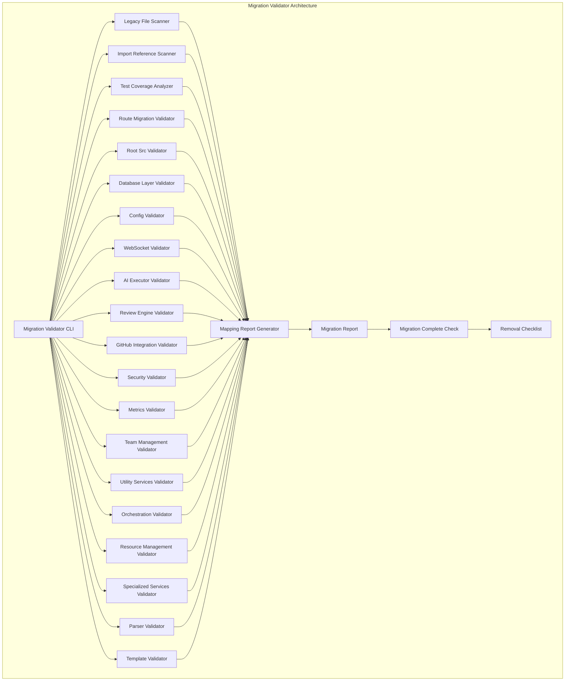

# Design Document: Complete NestJS Migration Validator

## Overview

This document describes the design of the Migration_Validator component for the PR Review Agent project. The Migration_Validator is responsible for verifying that the migration from legacy Express.js/ES Modules architecture to NestJS has been completed successfully.

The validator will scan the codebase to ensure:
- All 64 legacy files in `packages/backend/legacy/` have corresponding NestJS modules
- No import references to legacy code remain in the codebase
- Test coverage is adequate for migrated modules
- All route files are migrated to NestJS controllers
- Database, configuration, WebSocket, AI executor, review engine, GitHub integration, security, metrics, team management, utility services, orchestration, resource management, specialized services, parser, and template services are properly migrated
- Legacy folder can be safely removed

## Architecture



### Component Breakdown

#### 1. Legacy File Scanner
Scans the `packages/backend/legacy/` directory to identify all 64 legacy files and creates a mapping to their NestJS equivalents.

**Key Functions:**
- `scanLegacyFiles()` - Returns list of all .js files in legacy folder
- `findNestJSEquivalent(legacyFile)` - Finds corresponding NestJS module
- `createMappingReport()` - Generates Legacy_File → NestJS_Module mapping

#### 2. Import Reference Scanner
Scans the entire codebase for references to legacy files and reports any found.

**Key Functions:**
- `scanCodebaseForImports()` - Scans all directories for import references
- `detectImportType(importPath)` - Classifies import as relative or absolute
- `reportImportLocations()` - Reports file paths and line numbers of imports

#### 3. Test Coverage Analyzer
Verifies that all migrated NestJS modules have adequate test coverage.

**Key Functions:**
- `findTestFiles(modulePath)` - Identifies test files for a module
- `compareCoverage(legacyTest, nestTest)` - Compares test coverage
- `generateCoverageReport()` - Creates test coverage report with percentages

#### 4. Route Migration Validator
Verifies that all route files in `packages/backend/src/routes/` are migrated to NestJS controllers.

**Key Functions:**
- `scanRouteFiles()` - Identifies all .js files in routes folder
- `findControllerEquivalents(routeFile)` - Finds corresponding NestJS controller
- `verifyDecorators(controller)` - Verifies proper NestJS decorators

#### 5. Root Src Validator
Checks the root `src/` folder for legacy code and documentation relevance.

**Key Functions:**
- `scanRootSrcFiles()` - Identifies files in root src folder
- `analyzeFileUsage(filePath)` - Determines if file is still used
- `checkDocumentationRelevance()` - Verifies documentation relevance

#### 6. Database Layer Validator
Verifies that database layer uses TypeORM and legacy database files are not used.

**Key Functions:**
- `verifyTypeORMUsage()` - Checks for TypeORM entities and repositories
- `verifySchemaSync()` - Ensures schema.sql matches TypeORM entities
- `checkLegacyDBUsage()` - Verifies legacy database files are not referenced

#### 7. Config Validator
Verifies that configuration management uses @nestjs/config.

**Key Functions:**
- `verifyNestJSConfig()` - Checks for @nestjs/config usage
- `verifyValidationSchema()` - Ensures Joi schema in validation.schema.ts
- `checkLegacyConfigUsage()` - Verifies legacy config.js is not used

#### 8. WebSocket Validator
Verifies that WebSocket implementation uses NestJS Gateway.

**Key Functions:**
- `verifyGatewayImplementation()` - Checks for NestJS Gateway
- `verifyGatewayDecorators()` - Ensures proper @SubscribeMessage decorators
- `checkLegacyWSUsage()` - Verifies legacy websocket-server.js is not used

#### 9. AI Executor Validator
Verifies that AI executor services are migrated to NestJS.

**Key Functions:**
- `verifyExecutorImplementations()` - Checks all AI executors have implementations
- `verifyFixGenerator()` - Ensures ai-fix-generator.service.ts is implemented
- `checkLegacyAIUsage()` - Verifies legacy ai-executors.js is not used

#### 10. Review Engine Validator
Verifies that review engine core logic is migrated to NestJS.

**Key Functions:**
- `verifyReviewEngine()` - Checks review-engine.service.ts implementation
- `verifyReviewQueue()` - Ensures review-queue.service.ts is implemented
- `verifyChecklist()` - Ensures checklist.service.ts is implemented

#### 11. GitHub Integration Validator
Verifies that GitHub API integration is migrated to NestJS.

**Key Functions:**
- `verifyGitHubService()` - Checks github.service.ts implementation
- `verifyCIChecks()` - Ensures CI integration is migrated
- `verifyAutoMerge()` - Ensures auto-merge and auto-fix services are migrated

#### 12. Security Validator
Verifies that security scanning and compliance reporting are migrated.

**Key Functions:**
- `verifySecurityScanner()` - Checks security-scanner.service.ts
- `verifyDependencyScanner()` - Checks dependency-scanner.service.ts
- `verifyCompliance()` - Ensures compliance-reporter is migrated

#### 13. Metrics Validator
Verifies that metrics collection and analytics are migrated.

**Key Functions:**
- `verifyMetricsService()` - Checks metrics.service.ts
- `verifyHealthScore()` - Ensures health-score-calculator is migrated
- `verifyQualityScore()` - Ensures quality-scorer is migrated
- `verifyCoverageTracker()` - Ensures coverage-tracker is migrated

#### 14. Team Management Validator
Verifies that team management features are migrated.

**Key Functions:**
- `verifyAssignmentEngine()` - Checks assignment-engine.service.ts
- `verifyCapacityPlanner()` - Ensures capacity-planner is migrated
- `verifyGamification()` - Ensures gamification-engine is migrated

#### 15. Utility Services Validator
Verifies that utility services are migrated to NestJS common modules.

**Key Functions:**
- `verifyLogger()` - Checks logger.service.ts
- `verifyErrorHandler()` - Ensures error handling uses exception filters
- `verifyNotification()` - Ensures notification services are migrated

#### 16. Orchestration Validator
Verifies that workflow orchestration and task management are migrated.

**Key Functions:**
- `verifyOrchestration()` - Checks orchestration logic uses NestJS DI
- `verifyDelegate()` - Ensures delegate.js functionality is migrated
- `verifyBatchProcessor()` - Ensures batch-processor.service.ts is implemented

#### 17. Resource Management Validator
Verifies that resource management services are migrated.

**Key Functions:**
- `verifyCaching()` - Checks response caching implementation
- `verifyRetryStrategy()` - Ensures retry strategy is migrated
- `verifyRepositoryManager()` - Ensures repository-manager is migrated

#### 18. Specialized Services Validator
Verifies that specialized services are migrated.

**Key Functions:**
- `verifySLAMonitor()` - Checks sla-monitor is migrated
- `verifyFalsePositiveTracker()` - Ensures false-positive-tracker is migrated
- `verifyDiscussionTracker()` - Ensures discussion-tracker is migrated

#### 19. Parser Validator
Verifies that comment parser and template services are migrated.

**Key Functions:**
- `verifyCommentParser()` - Checks comment-parser.service.ts
- `verifyTemplateManager()` - Ensures template-manager is migrated
- `verifyRoundTrip()` - Tests parsing → formatting → parsing round trip

#### 20. Migration Report Generator
Generates comprehensive migration reports and removal checklists.

**Key Functions:**
- `generateMigrationReport()` - Creates complete migration report
- `generateRemovalChecklist()` - Creates pre-removal verification checklist
- `generateBackupStrategy()` - Recommends backup strategy

## Data Models

### LegacyFile
```typescript
interface LegacyFile {
  path: string;
  filename: string;
  hasNestJSEquivalent: boolean;
  nestJSEquivalent?: string;
  unmigratedReason?: string;
  migrationPriority?: 'high' | 'medium' | 'low';
}
```

### ImportReference
```typescript
interface ImportReference {
  filePath: string;
  lineNumber: number;
  importPath: string;
  importType: 'relative' | 'absolute';
  legacyFile?: string;
}
```

### TestCoverage
```typescript
interface TestCoverage {
  modulePath: string;
  hasTests: boolean;
  testFilePath?: string;
  coveragePercentage?: number;
  legacyCoverage?: number;
  needsTesting: boolean;
}
```

### RouteFile
```typescript
interface RouteFile {
  path: string;
  filename: string;
  hasControllerEquivalent: boolean;
  controllerEquivalent?: string;
  endpoints: RouteEndpoint[];
  needsMigration: boolean;
}

interface RouteEndpoint {
  method: 'GET' | 'POST' | 'PUT' | 'DELETE' | 'PATCH';
  path: string;
  existsInController: boolean;
}
```

### MigrationReport
```typescript
interface MigrationReport {
  legacyFiles: LegacyFile[];
  importReferences: ImportReference[];
  testCoverage: TestCoverage[];
  routeFiles: RouteFile[];
  rootSrcFiles: RootSrcFile[];
  databaseLayer: DatabaseLayerStatus;
  config: ConfigStatus;
  websocket: WebSocketStatus;
  aiExecutors: AIExecutorStatus[];
  reviewEngine: ReviewEngineStatus;
  githubIntegration: GitHubIntegrationStatus;
  security: SecurityStatus;
  metrics: MetricsStatus;
  teamManagement: TeamManagementStatus;
  utilityServices: UtilityServiceStatus[];
  orchestration: OrchestrationStatus;
  resourceManagement: ResourceManagementStatus;
  specializedServices: SpecializedServiceStatus[];
  parser: ParserStatus;
  templateManager: TemplateManagerStatus;
  overallStatus: 'complete' | 'incomplete' | 'needs_review';
  unmigratedFiles: string[];
  recommendations: string[];
}
```

### RootSrcFile
```typescript
interface RootSrcFile {
  path: string;
  filename: string;
  isCode: boolean;
  isUsed: boolean;
  importReferences: ImportReference[];
  recommendation: 'keep' | 'remove' | 'review';
}
```

### DatabaseLayerStatus
```typescript
interface DatabaseLayerStatus {
  legacyDBFilesUsed: boolean;
  typeORMConfigComplete: boolean;
  schemaSync: boolean;
  legacyQueriesMigrated: boolean;
}
```

### ConfigStatus
```typescript
interface ConfigStatus {
  legacyConfigUsed: boolean;
  nestJSConfigModule: boolean;
  validationSchema: boolean;
  configServicesIntegrated: boolean;
  hardcodedConfigMigrated: boolean;
}
```

### WebSocketStatus
```typescript
interface WebSocketStatus {
  legacyWSUsed: boolean;
  gatewayImplementation: boolean;
  gatewayDecorators: boolean;
  clientConnections: boolean;
  authAndAuthz: boolean;
}
```

### AIExecutorStatus
```typescript
interface AIExecutorStatus {
  executorType: 'gemini' | 'copilot' | 'kiro' | 'claude' | 'codex' | 'opencode';
  implemented: boolean;
  configIntegrated: boolean;
}
```

### ReviewEngineStatus
```typescript
interface ReviewEngineStatus {
  legacyEngineUsed: boolean;
  reviewEngineImplemented: boolean;
  reviewQueueImplemented: boolean;
  checklistImplemented: boolean;
  workflowComplete: boolean;
}
```

### GitHubIntegrationStatus
```typescript
interface GitHubIntegrationStatus {
  legacyGitHubUsed: boolean;
  githubServiceImplemented: boolean;
  ghCLITegrated: boolean;
  ciIntegrationMigrated: boolean;
  autoMergeMigrated: boolean;
  autoFixMigrated: boolean;
}
```

### SecurityStatus
```typescript
interface SecurityStatus {
  legacySecurityUsed: boolean;
  securityScannerImplemented: boolean;
  dependencyScannerImplemented: boolean;
  complianceMigrated: boolean;
  licenseScannerImplemented: boolean;
  sensitiveDataHandlerMigrated: boolean;
}
```

### MetricsStatus
```typescript
interface MetricsStatus {
  legacyMetricsUsed: boolean;
  metricsServiceImplemented: boolean;
  healthScoreMigrated: boolean;
  qualityScoreMigrated: boolean;
  coverageTrackerMigrated: boolean;
  performanceAlertMigrated: boolean;
  dataExporterMigrated: boolean;
}
```

### TeamManagementStatus
```typescript
interface TeamManagementStatus {
  legacyAssignmentUsed: boolean;
  assignmentEngineImplemented: boolean;
  capacityPlannerMigrated: boolean;
  developerDashboardMigrated: boolean;
  gamificationMigrated: boolean;
  feedbackAnalyzerMigrated: boolean;
}
```

### UtilityServiceStatus
```typescript
interface UtilityServiceStatus {
  serviceType: 'logger' | 'errorHandler' | 'notification' | 'email' | 'gracefulShutdown' | 'auditLogger';
  legacyUsed: boolean;
  migrated: boolean;
  implementation?: string;
}
```

### OrchestrationStatus
```typescript
interface OrchestrationStatus {
  legacyOrchestrationUsed: boolean;
  orchestrationMigrated: boolean;
  delegateMigrated: boolean;
  batchProcessorMigrated: boolean;
  taskLockManagerMigrated: boolean;
  stuckTaskDetectorMigrated: boolean;
}
```

### ResourceManagementStatus
```typescript
interface ResourceManagementStatus {
  legacyResourceManagerUsed: boolean;
  cachingMigrated: boolean;
  retryStrategyMigrated: boolean;
  repositoryManagerMigrated: boolean;
  elapsedTimeTrackerMigrated: boolean;
}
```

### SpecializedServiceStatus
```typescript
interface SpecializedServiceStatus {
  serviceType: 'slaMonitor' | 'falsePositiveTracker' | 'rejectionCategorizer' | 'discussionTracker' | 'escalationService' | 'smartNotificationEngine' | 'visualizationFormatter';
  migrated: boolean;
}
```

### ParserStatus
```typescript
interface ParserStatus {
  legacyParserUsed: boolean;
  parserImplemented: boolean;
  templateManagerMigrated: boolean;
  roundTripValid: boolean;
}
```

### TemplateManagerStatus
```typescript
interface TemplateManagerStatus {
  legacyTemplateManagerUsed: boolean;
  templateManagerMigrated: boolean;
}
```

## API Specifications for Migration_Validator

### CLI Interface

```typescript
// Migration Validator CLI
interface MigrationValidatorCLI {
  // Main validation command
  validate(options: ValidateOptions): Promise<MigrationReport>;
  
  // Individual validators
  validateLegacyFiles(): Promise<LegacyFile[]>;
  validateImportReferences(): Promise<ImportReference[]>;
  validateTestCoverage(): Promise<TestCoverage[]>;
  validateRouteMigration(): Promise<RouteFile[]>;
  validateRootSrc(): Promise<RootSrcFile[]>;
  validateDatabaseLayer(): Promise<DatabaseLayerStatus>;
  validateConfig(): Promise<ConfigStatus>;
  validateWebSocket(): Promise<WebSocketStatus>;
  validateAIExecutors(): Promise<AIExecutorStatus[]>;
  validateReviewEngine(): Promise<ReviewEngineStatus>;
  validateGitHubIntegration(): Promise<GitHubIntegrationStatus>;
  validateSecurity(): Promise<SecurityStatus>;
  validateMetrics(): Promise<MetricsStatus>;
  validateTeamManagement(): Promise<TeamManagementStatus>;
  validateUtilityServices(): Promise<UtilityServiceStatus[]>;
  validateOrchestration(): Promise<OrchestrationStatus>;
  validateResourceManagement(): Promise<ResourceManagementStatus>;
  validateSpecializedServices(): Promise<SpecializedServiceStatus[]>;
  validateParser(): Promise<ParserStatus>;
  validateTemplateManager(): Promise<TemplateManagerStatus>;
  
  // Report generation
  generateMigrationReport(): Promise<MigrationReport>;
  generateRemovalChecklist(report: MigrationReport): Promise<string[]>;
  generateBackupStrategy(report: MigrationReport): Promise<string>;
}
```

### ValidateOptions
```typescript
interface ValidateOptions {
  verbose?: boolean;
  outputFormat?: 'json' | 'text' | 'markdown';
  outputDirectory?: string;
  skipTests?: boolean;
  skipImports?: boolean;
  skipLegacyFiles?: boolean;
}
```

### Output Formats

#### JSON Output
```json
{
  "legacyFiles": [...],
  "importReferences": [...],
  "testCoverage": [...],
  "routeFiles": [...],
  "overallStatus": "complete" | "incomplete" | "needs_review",
  "unmigratedFiles": [...],
  "recommendations": [...]
}
```

#### Text Output
```
Migration Validator Report
==========================

Legacy Files: 64/64 migrated
Import References: 0 found
Test Coverage: 85% average
Route Files: 9/9 migrated

Overall Status: COMPLETE

Recommendations:
- All legacy files have been migrated
- No import references to legacy code found
- Test coverage is adequate
- Legacy folder can be safely removed
```

#### Markdown Output
```markdown
# Migration Validator Report

## Summary
- **Legacy Files**: 64/64 migrated
- **Import References**: 0 found
- **Test Coverage**: 85% average
- **Route Files**: 9/9 migrated
- **Overall Status**: ✅ COMPLETE

## Details
[Detailed breakdown of each validation category]
```

### Exit Codes

| Code | Meaning |
|------|---------|
| 0 | Migration complete, all validations passed |
| 1 | Migration incomplete, some validations failed |
| 2 | Migration needs review, some items require manual verification |
| 3 | Validation error, CLI usage error |

## Testing Strategy

### Dual Testing Approach

**Unit Tests**: Verify specific examples, edge cases, and error conditions
**Property Tests**: Verify universal properties across all inputs

### Unit Testing Focus

- Specific examples that demonstrate correct behavior
- Integration points between components
- Edge cases and error conditions
- Report generation formats

### Property-Based Testing Focus

- Universal properties that hold for all inputs
- Comprehensive input coverage through randomization
- Round-trip properties for parsers and serializers

### Property-Based Testing Configuration

- Minimum 100 iterations per property test
- Each property test references its design document property
- Tag format: **Feature: complete-nestjs-migration, Property {number}: {property_text}**

### Test Files Structure

```
tests/
├── migration/
│   ├── legacy-file-scanner.test.js
│   ├── import-reference-scanner.test.js
│   ├── test-coverage-analyzer.test.js
│   ├── route-migration-validator.test.js
│   ├── root-src-validator.test.js
│   ├── database-layer-validator.test.js
│   ├── config-validator.test.js
│   ├── websocket-validator.test.js
│   ├── ai-executor-validator.test.js
│   ├── review-engine-validator.test.js
│   ├── github-integration-validator.test.js
│   ├── security-validator.test.js
│   ├── metrics-validator.test.js
│   ├── team-management-validator.test.js
│   ├── utility-services-validator.test.js
│   ├── orchestration-validator.test.js
│   ├── resource-management-validator.test.js
│   ├── specialized-services-validator.test.js
│   ├── parser-validator.test.js
│   ├── template-manager-validator.test.js
│   └── migration-report-generator.test.js
```

## Implementation Plan

### Phase 1: Core Infrastructure (Week 1)
- Create Migration_Validator CLI structure
- Implement Legacy File Scanner
- Implement Import Reference Scanner
- Implement basic report generation

### Phase 2: Module Validators (Week 2-3)
- Implement Database Layer Validator
- Implement Config Validator
- Implement WebSocket Validator
- Implement AI Executor Validator
- Implement Review Engine Validator
- Implement GitHub Integration Validator

### Phase 3: Feature Validators (Week 4)
- Implement Security Validator
- Implement Metrics Validator
- Implement Team Management Validator
- Implement Utility Services Validator
- Implement Orchestration Validator
- Implement Resource Management Validator
- Implement Specialized Services Validator

### Phase 4: Parser & Template Validators (Week 5)
- Implement Parser Validator
- Implement Template Manager Validator
- Implement round-trip property tests

### Phase 5: Report Generation & CLI (Week 6)
- Implement comprehensive report generation
- Implement removal checklist generation
- Implement backup strategy recommendations
- Finalize CLI interface

### Phase 6: Testing & Documentation (Week 7)
- Write unit tests for all validators
- Write property-based tests for universal properties
- Write integration tests
- Create documentation
- Create migration guide

## Correctness Properties

*A property is a characteristic or behavior that should hold true across all valid executions of a system-essentially, a formal statement about what the system should do. Properties serve as the bridge between human-readable specifications and machine-verifiable correctness guarantees.*

### Property 1: Legacy file count verification

*For any* valid project structure, the Legacy File Scanner shall identify exactly 64 legacy files in the `packages/backend/legacy/` directory.

**Validates: Requirements 1.1**

### Property 2: Legacy file to NestJS module mapping

*For any* legacy file in the `packages/backend/legacy/` directory, if a corresponding NestJS module exists, the Migration Validator shall correctly identify and map it.

**Validates: Requirements 1.2**

### Property 3: Unmigrated file detection

*For any* legacy file without a corresponding NestJS module, the Migration Validator shall correctly identify it as "unmigrated" and assign appropriate migration priority.

**Validates: Requirements 1.4**

### Property 4: Import reference detection

*For any* codebase with import references to legacy files, the Import Reference Scanner shall detect and report all references with file paths and line numbers.

**Validates: Requirements 2.1, 2.3**

### Property 5: Import type classification

*For any* import statement, the Import Reference Scanner shall correctly classify it as either "relative" or "absolute" based on its format.

**Validates: Requirements 2.4**

### Property 6: Package.json script verification

*For any* package.json file, the Migration Validator shall correctly identify if it contains scripts that directly execute legacy files.

**Validates: Requirements 2.5**

### Property 7: Test coverage verification

*For any* migrated NestJS module, the Test Coverage Analyzer shall correctly identify whether test coverage exists and calculate coverage percentage.

**Validates: Requirements 3.1, 3.2**

### Property 8: Route file to controller mapping

*For any* route file in the `packages/backend/src/routes/` directory, the Route Migration Validator shall correctly identify if it has a corresponding NestJS controller.

**Validates: Requirements 4.2**

### Property 9: Decorator verification

*For any* NestJS controller, the Route Migration Validator shall correctly verify that it uses proper NestJS decorators (@Controller, @Get, @Post, etc.).

**Validates: Requirements 4.5**

### Property 10: Root src file analysis

*For any* file in the root `src/` folder, the Root Src Validator shall correctly analyze whether it is still in use and provide appropriate recommendation.

**Validates: Requirements 5.2, 5.3**

### Property 11: Database layer TypeORM verification

*For any* database operations in the codebase, the Database Layer Validator shall correctly verify that they use TypeORM entities and repositories instead of legacy database files.

**Validates: Requirements 6.2**

### Property 12: Schema synchronization

*For any* TypeORM entity, the Database Layer Validator shall correctly verify that the schema.sql file is synchronized with the entity definitions.

**Validates: Requirements 6.5**

### Property 13: Configuration migration verification

*For any* configuration access in the codebase, the Config Validator shall correctly verify that it uses @nestjs/config instead of legacy config.js.

**Validates: Requirements 7.2**

### Property 14: Validation schema verification

*For any* environment variable access, the Config Validator shall correctly verify that it is validated using the Joi schema in validation.schema.ts.

**Validates: Requirements 7.3**

### Property 15: WebSocket gateway verification

*For any* WebSocket event in the codebase, the WebSocket Validator shall correctly verify that it uses NestJS Gateway decorators (@SubscribeMessage, @WebSocketGateway) instead of legacy websocket-server.js.

**Validates: Requirements 8.3**

### Property 16: AI executor implementation verification

*For any* AI executor type (Gemini, Copilot, Kiro, Claude, Codex, OpenCode), the AI Executor Validator shall correctly verify that it has a corresponding implementation in the NestJS module.

**Validates: Requirements 9.3**

### Property 17: Review engine workflow verification

*For any* PR review workflow, the Review Engine Validator shall correctly verify that the complete workflow (scan PR, clone repo, run AI review, post comments) is implemented in NestJS.

**Validates: Requirements 10.3**

### Property 18: GitHub service integration verification

*For any* GitHub API call in the codebase, the GitHub Integration Validator shall correctly verify that it uses the NestJS github.service.ts instead of legacy github.js.

**Validates: Requirements 11.2**

### Property 19: Security service migration verification

*For any* security scanning operation in the codebase, the Security Validator shall correctly verify that it uses the migrated NestJS security services instead of legacy security-scanner.js.

**Validates: Requirements 12.1**

### Property 20: Metrics service migration verification

*For any* metrics collection operation in the codebase, the Metrics Validator shall correctly verify that it uses the migrated NestJS metrics services instead of legacy metrics-engine.js.

**Validates: Requirements 13.2**

### Property 21: Team management service migration verification

*For any* team management operation in the codebase, the Team Management Validator shall correctly verify that it uses the migrated NestJS team services instead of legacy assignment-engine.js.

**Validates: Requirements 14.2**

### Property 22: Utility service migration verification

*For any* utility service (logger, error handler, notification, etc.) in the codebase, the Utility Services Validator shall correctly verify that it uses the migrated NestJS services instead of legacy implementations.

**Validates: Requirements 15.1**

### Property 23: Orchestration service migration verification

*For any* orchestration operation in the codebase, the Orchestration Validator shall correctly verify that it uses the migrated NestJS services with proper dependency injection instead of legacy workflow-orchestrator.js.

**Validates: Requirements 16.2**

### Property 24: Resource management migration verification

*For any* resource management operation in the codebase, the Resource Management Validator shall correctly verify that it uses the migrated NestJS services instead of legacy resource-manager.js.

**Validates: Requirements 17.2**

### Property 25: Specialized service migration verification

*For any* specialized service (SLA monitor, false positive tracker, etc.) in the codebase, the Specialized Services Validator shall correctly verify that it has been migrated to NestJS.

**Validates: Requirements 18.2**

### Property 26: Comment parser round-trip

*For any* valid AI review output, parsing then formatting then parsing shall produce equivalent structured data.

**Validates: Requirements 19.5**

### Property 27: Migration report generation

*For any* set of validation results, the Migration Report Generator shall correctly generate a comprehensive report with all required information.

**Validates: Requirements 20.1**

### Property 28: Removal checklist generation

*For any* migration report with complete status, the Migration Report Generator shall correctly generate a removal checklist with all required verification steps.

**Validates: Requirements 20.2**

## Error Handling

### Error Types

1. **ScanError**: Errors during file scanning operations
2. **ParseError**: Errors during import parsing
3. **ValidationError**: Errors during validation logic
4. **ReportError**: Errors during report generation

### Error Handling Strategy

- Custom error classes with descriptive messages
- Graceful degradation for non-critical validations
- Detailed error logging for debugging
- User-friendly error messages for CLI

### Error Codes

| Code | Meaning |
|------|---------|
| SCAN_FAILED | File scanning operation failed |
| PARSE_FAILED | Import parsing operation failed |
| VALIDATION_FAILED | Validation logic failed |
| REPORT_FAILED | Report generation failed |
| CONFIG_ERROR | Configuration error |
| PERMISSION_ERROR | Permission error accessing files |

## Testing Strategy

### Unit Tests

Unit tests verify specific examples, edge cases, and error conditions:

- Test legacy file scanning with various file structures
- Test import reference detection with different import patterns
- Test report generation with various validation results
- Test error handling with simulated failures
- Test edge cases (empty directories, missing files, etc.)

### Property-Based Tests

Property-based tests verify universal properties across all inputs:

- Test that all legacy files are correctly identified (Property 1)
- Test that all import references are correctly detected (Property 4)
- Test that all route files are correctly mapped (Property 8)
- Test that all AI executors are correctly verified (Property 16)
- Test comment parser round-trip property (Property 26)

### Property-Based Testing Configuration

- Minimum 100 iterations per property test
- Each property test references its design document property
- Tag format: **Feature: complete-nestjs-migration, Property {number}: {property_text}**

### Test Coverage Targets

- Legacy file scanner: 100%
- Import reference scanner: 100%
- Test coverage analyzer: 100%
- Route migration validator: 100%
- Root src validator: 100%
- Database layer validator: 100%
- Config validator: 100%
- WebSocket validator: 100%
- AI executor validator: 100%
- Review engine validator: 100%
- GitHub integration validator: 100%
- Security validator: 100%
- Metrics validator: 100%
- Team management validator: 100%
- Utility services validator: 100%
- Orchestration validator: 100%
- Resource management validator: 100%
- Specialized services validator: 100%
- Parser validator: 100%
- Template manager validator: 100%
- Migration report generator: 100%

### Integration Tests

Integration tests verify the complete migration validation workflow:

- Test full validation pipeline with sample codebase
- Test report generation with complete validation results
- Test CLI interface with various options
- Test error handling with simulated failures

### E2E Tests

E2E tests verify the complete migration validation workflow:

- Test full validation with real codebase
- Test report generation with real validation results
- Test CLI interface with real usage scenarios

## Implementation Notes

### Key Design Decisions

1. **Modular Architecture**: Each validator is a separate module for maintainability and testability
2. **Consistent Data Models**: All validators return standardized data models for report generation
3. **Extensible Design**: New validators can be easily added without modifying existing code
4. **Comprehensive Reporting**: Reports include detailed information for debugging and verification
5. **Multiple Output Formats**: Support for JSON, text, and markdown output formats

### Performance Considerations

1. **Parallel Scanning**: File scanning and import reference detection can be parallelized
2. **Caching**: Results can be cached to avoid redundant scanning
3. **Incremental Validation**: Support for incremental validation of changed files
4. **Memory Efficiency**: Stream processing for large files

### Security Considerations

1. **Path Validation**: Validate file paths to prevent path traversal attacks
2. **Input Sanitization**: Sanitize file contents before parsing
3. **Access Control**: Verify read permissions before scanning files
4. **Error Handling**: Prevent information leakage through error messages

### Maintainability Considerations

1. **Code Organization**: Clear separation of concerns with dedicated modules
2. **Documentation**: Comprehensive documentation for each validator
3. **Testing**: Comprehensive test coverage for all validators
4. **Error Handling**: Consistent error handling across all validators
5. **Logging**: Detailed logging for debugging and monitoring

## Success Criteria

Migration validation is considered successful when:

- All 64 legacy files have corresponding NestJS modules
- No import references to legacy code remain in the codebase
- Test coverage for migrated modules reaches minimal 80%
- All route files are migrated to NestJS controllers
- Root src folder contains no active legacy code
- Application functions correctly without legacy folder
- Migration documentation is complete and accurate

## Next Steps

After completing the design:

1. Implement the Migration_Validator CLI
2. Implement all validators
3. Write unit tests for each validator
4. Write property-based tests for universal properties
5. Write integration tests
6. Create documentation
7. Create migration guide
