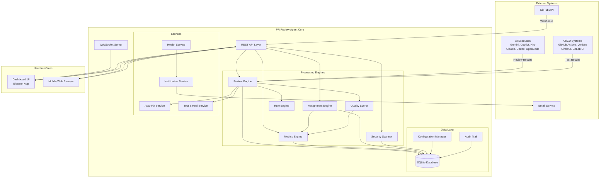
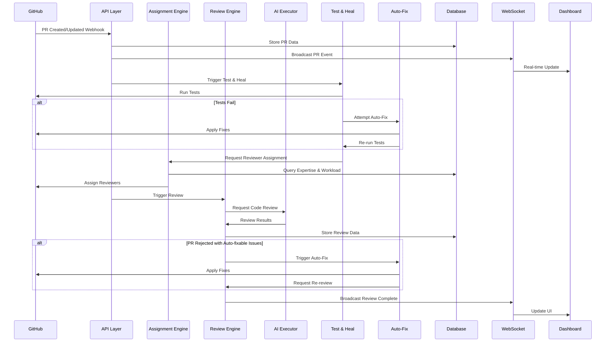
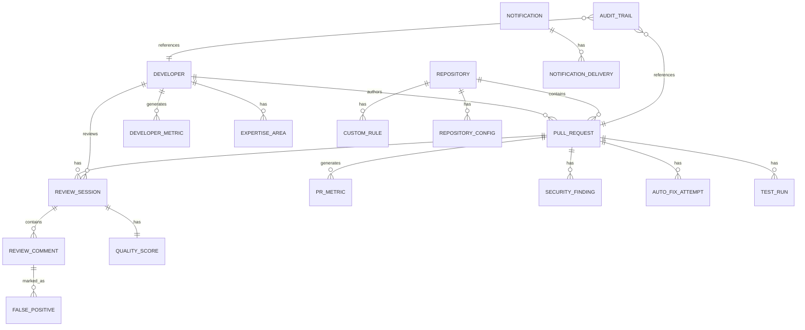
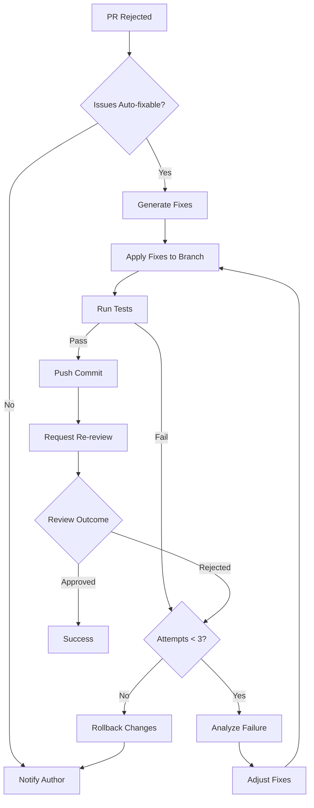
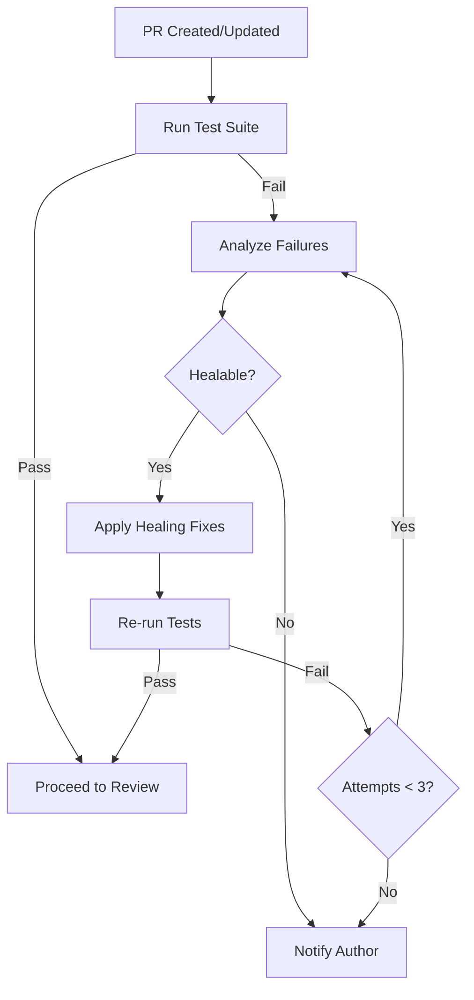

# Design Document: PR Review Agent Enhancements

## Overview

The PR Review Agent enhancements transform a basic automated GitHub PR review system into a comprehensive development process management platform. The system provides intelligent review automation, team analytics, quality control, security scanning, self-healing capabilities, and real-time monitoring.

### Core Objectives

- Reduce average PR review time by 40% through intelligent automation
- Maintain review quality scores above 75/100 through quality control mechanisms
- Achieve 99% system uptime through self-healing and reliability features
- Provide actionable insights through comprehensive analytics and reporting
- Ensure security and compliance through automated scanning and audit trails
- Enable autonomous operation through auto-fix and test & heal capabilities

### Key Capabilities

1. **Intelligent Review Automation**: AI-powered code review with multiple executor support (Gemini, Copilot, Kiro, Claude, Codex, OpenCode)
2. **Analytics & Reporting**: Comprehensive metrics collection, visualization, and trend analysis
3. **Team Management**: Smart reviewer assignment, workload balancing, and capacity planning
4. **Quality Control**: Review quality scoring, custom rule engine, and checklist compliance
5. **Security & Compliance**: Vulnerability detection, license compliance, sensitive data scanning, and audit trails
6. **Self-Healing**: Automatic PR fixes, test & heal workflows, and auto-recovery mechanisms
7. **Real-time Monitoring**: WebSocket-based dashboard with live updates and health monitoring
8. **Developer Experience**: Personal dashboards, feedback analytics, gamification, and smart notifications


## Architecture

### High-Level System Architecture



### Data Flow



### Technology Stack

- **Runtime**: Node.js (ES modules)
- **Desktop Framework**: Electron
- **Database**: SQLite with better-sqlite3 driver
- **GitHub Integration**: GitHub CLI (gh)
- **AI Integration**: Multiple CLI tools (gemini-cli, copilot-cli, kiro-cli, claude-cli, codex-cli, opencode-cli)
- **Real-time Communication**: WebSocket (ws library)
- **API Framework**: Express.js
- **Configuration**: JSON/YAML parsing
- **Testing**: Property-based testing library (fast-check for Node.js)

## Components and Interfaces

### Review Engine

The Review Engine orchestrates the entire review process from PR detection to completion.

**Responsibilities**:
- Coordinate review workflow across multiple AI executors
- Manage review sessions and track progress
- Integrate with Test & Heal and Auto-Fix services
- Apply custom rules and quality checks
- Generate formatted review reports

**Interface**:
```javascript
class ReviewEngine {
  // Trigger review for a PR
  async reviewPR(prId, options)
  
  // Get review status
  async getReviewStatus(reviewSessionId)
  
  // Cancel ongoing review
  async cancelReview(reviewSessionId)
  
  // Re-review after fixes
  async reReview(prId, previousReviewId)
  
  // Get review history for PR
  async getReviewHistory(prId)
}
```

**Key Algorithms**:
- Review orchestration: Sequential execution of test & heal → rule validation → AI review → quality scoring
- Comment parsing: Extract structured data from AI executor output using regex and AST parsing
- Review level determination: Match branch patterns to strictness levels (strict/standard/relaxed)


### Assignment Engine

The Assignment Engine intelligently assigns reviewers based on expertise, workload, and availability.

**Responsibilities**:
- Analyze PR content to determine required expertise
- Track reviewer expertise from historical data
- Calculate current workload per reviewer
- Assign optimal reviewers while balancing workload
- Handle batch and orchestration set assignments

**Interface**:
```javascript
class AssignmentEngine {
  // Assign reviewers to a PR
  async assignReviewers(prId, requiredCount = 2)
  
  // Update reviewer expertise based on activity
  async updateExpertise(developerId, filePatterns)
  
  // Get current workload for reviewer
  async getWorkload(developerId)
  
  // Mark reviewer as unavailable
  async setAvailability(developerId, available, until)
  
  // Get expertise match score
  async getExpertiseScore(developerId, filePatterns)
}
```

**Key Algorithms**:
- Expertise scoring: TF-IDF style scoring based on file path patterns and historical contributions
- Workload calculation: Weighted sum of pending reviews and authored PRs
- Assignment optimization: Multi-criteria scoring (expertise × 0.5 + availability × 0.3 + workload_inverse × 0.2)

### Metrics Engine

The Metrics Engine collects, aggregates, and analyzes review performance data.

**Responsibilities**:
- Record review sessions and outcomes
- Calculate aggregate metrics (averages, rates, trends)
- Track developer and team performance
- Identify patterns and anomalies
- Generate time-series data for visualization

**Interface**:
```javascript
class MetricsEngine {
  // Record review completion
  async recordReview(reviewData)
  
  // Calculate metrics for time range
  async calculateMetrics(startDate, endDate, filters)
  
  // Get developer performance
  async getDeveloperMetrics(developerId, timeRange)
  
  // Get repository metrics
  async getRepositoryMetrics(repoId, timeRange)
  
  // Detect performance anomalies
  async detectAnomalies(metricType, threshold)
  
  // Get trend analysis
  async getTrends(metricType, timeRange, granularity)
}
```

**Key Algorithms**:
- Moving average calculation: Exponential weighted moving average for trend smoothing
- Anomaly detection: Z-score based detection (flag when > 2 standard deviations from mean)
- Aggregation: Time-bucketing with configurable granularity (hour/day/week/month)


### Quality Scorer

The Quality Scorer evaluates review thoroughness and helpfulness.

**Responsibilities**:
- Analyze review comments for quality indicators
- Calculate review quality scores (0-100)
- Track false positive rates
- Provide quality feedback to improve reviews

**Interface**:
```javascript
class QualityScorer {
  // Score a review session
  async scoreReview(reviewSessionId)
  
  // Mark comment as false positive
  async markFalsePositive(commentId, justification)
  
  // Get quality score breakdown
  async getScoreBreakdown(reviewSessionId)
  
  // Calculate false positive rate
  async getFalsePositiveRate(executorId, issueCategory)
  
  // Get quality trends
  async getQualityTrends(executorId, timeRange)
}
```

**Key Algorithms**:
- Quality scoring formula: `score = (thoroughness × 0.4) + (helpfulness × 0.3) + (accuracy × 0.3)`
  - Thoroughness: Based on issues found, code coverage reviewed, comment depth
  - Helpfulness: Based on constructive feedback, suggestions provided, clarity
  - Accuracy: Based on false positive rate (inverse)
- False positive rate: `FP_rate = false_positives / (false_positives + true_positives)`

### Rule Engine

The Rule Engine enforces custom coding standards and team-specific checks.

**Responsibilities**:
- Load and validate custom rules from configuration
- Execute regex-based pattern matching
- Execute AST-based structural checks
- Categorize violations by severity
- Provide rule management interface

**Interface**:
```javascript
class RuleEngine {
  // Load rules from configuration
  async loadRules(repoId)
  
  // Execute rules against PR diff
  async executeRules(prId, reviewLevel)
  
  // Validate rule syntax
  async validateRule(ruleDefinition)
  
  // Add/update custom rule
  async saveRule(repoId, rule)
  
  // Get rule violations
  async getViolations(prId)
  
  // Test rule against sample code
  async testRule(ruleId, sampleCode)
}
```

**Rule Definition Format**:
```javascript
{
  id: "no-console-log",
  name: "Disallow console.log in production",
  type: "regex", // or "ast"
  pattern: "console\\.log\\(",
  severity: "warning", // error, warning, info
  message: "Remove console.log statements before merging",
  autoFixable: true,
  autoFix: "// console.log($1)",
  enabled: true,
  branches: ["main", "production"]
}
```


### Security Scanner

The Security Scanner detects vulnerabilities, license issues, and sensitive data.

**Responsibilities**:
- Scan for common vulnerability patterns (SQL injection, XSS, CSRF)
- Check dependencies for known CVEs
- Validate dependency licenses
- Detect accidentally committed secrets and PII
- Generate security reports

**Interface**:
```javascript
class SecurityScanner {
  // Scan PR for security issues
  async scanPR(prId)
  
  // Check dependencies for CVEs
  async checkDependencies(dependencies)
  
  // Validate licenses
  async validateLicenses(dependencies, allowlist, blocklist)
  
  // Detect sensitive data
  async detectSensitiveData(diff)
  
  // Get security findings
  async getFindings(prId)
  
  // Generate security report
  async generateReport(prId)
}
```

**Detection Patterns**:
- SQL Injection: Regex patterns for string concatenation in SQL queries
- XSS: Patterns for unescaped user input in HTML contexts
- Secrets: Patterns for API keys, tokens, passwords (high entropy strings, known formats)
- PII: Patterns for emails, phone numbers, SSNs, credit cards
- CVE Database: Integration with GitHub Security Advisories and npm audit

### Notification Service

The Notification Service manages all system notifications and alerts.

**Responsibilities**:
- Send email notifications
- Batch related notifications
- Respect user preferences and quiet hours
- Generate daily digest reports
- Handle escalation workflows

**Interface**:
```javascript
class NotificationService {
  // Send notification
  async sendNotification(userId, type, data)
  
  // Send batch notification
  async sendBatch(userId, notifications)
  
  // Generate daily digest
  async generateDigest(userId, date)
  
  // Escalate issue
  async escalate(prId, reason, escalationLevel)
  
  // Update user preferences
  async updatePreferences(userId, preferences)
  
  // Check if notification should be sent
  async shouldNotify(userId, type, context)
}
```

**Notification Types**:
- `pr_created`, `pr_updated`, `pr_merged`, `pr_rejected`
- `review_complete`, `review_requested`, `review_overdue`
- `sla_warning`, `sla_exceeded`
- `security_finding`, `sensitive_data_detected`
- `workload_warning`, `capacity_warning`
- `escalation`, `stuck_task`


### Health Service

The Health Service monitors system health and triggers auto-recovery.

**Responsibilities**:
- Monitor system components and resources
- Detect stuck tasks and trigger recovery
- Track health metrics and trends
- Alert administrators of critical issues
- Provide health check endpoints

**Interface**:
```javascript
class HealthService {
  // Get overall health status
  async getHealthStatus()
  
  // Get detailed health metrics
  async getDetailedHealth()
  
  // Detect stuck tasks
  async detectStuckTasks()
  
  // Trigger auto-recovery
  async recoverTask(taskId)
  
  // Monitor resource usage
  async monitorResources()
  
  // Log health check
  async logHealthCheck(results)
}
```

**Health Checks**:
- Database connectivity and response time
- Disk space availability (warn at 80%, critical at 90%)
- Memory usage (warn at 70%, critical at 85%)
- GitHub API rate limits and quota
- AI executor availability and response times
- WebSocket connection count and health

### Auto-Fix Service

The Auto-Fix Service automatically fixes common issues in rejected PRs.

**Responsibilities**:
- Analyze rejection reasons for fixability
- Generate and apply code fixes
- Run tests to verify fixes
- Manage fix iterations and rollback
- Track auto-fix success rates

**Interface**:
```javascript
class AutoFixService {
  // Attempt to fix PR issues
  async fixPR(prId, reviewSessionId)
  
  // Check if issues are auto-fixable
  async isFixable(issues)
  
  // Generate fixes for issues
  async generateFixes(issues)
  
  // Apply fixes to PR branch
  async applyFixes(prId, fixes)
  
  // Verify fixes with tests
  async verifyFixes(prId)
  
  // Rollback failed fixes
  async rollbackFixes(prId, commitSha)
  
  // Get fix history
  async getFixHistory(prId)
}
```

**Auto-Fixable Issue Types**:
- Code formatting (prettier, eslint --fix)
- Import organization and unused imports
- Missing semicolons, trailing commas
- Simple type errors (TypeScript)
- Whitespace and indentation
- Console.log removal
- Simple refactorings (variable renaming, extract constant)


### Test & Heal Service

The Test & Heal Service runs tests and attempts to fix failures before review.

**Responsibilities**:
- Run configured test suites automatically
- Analyze test failures for fixability
- Apply common test fixes
- Re-run tests after healing
- Track test & heal metrics

**Interface**:
```javascript
class TestAndHealService {
  // Run tests for PR
  async runTests(prId)
  
  // Analyze test failures
  async analyzeFailures(testResults)
  
  // Attempt to heal test failures
  async healFailures(prId, failures)
  
  // Get test results
  async getTestResults(prId)
  
  // Get heal history
  async getHealHistory(prId)
  
  // Calculate success metrics
  async getHealMetrics(timeRange)
}
```

**Healable Test Failure Types**:
- Import errors (missing imports, wrong paths)
- Formatting issues causing test failures
- Type errors in test files
- Snapshot mismatches (update snapshots)
- Timeout issues (increase timeout)

## Data Models

### Database Schema

The system uses SQLite with the following schema design:



### Core Tables

**pull_requests**
```sql
CREATE TABLE pull_requests (
  id INTEGER PRIMARY KEY AUTOINCREMENT,
  github_pr_id INTEGER NOT NULL UNIQUE,
  repository_id INTEGER NOT NULL,
  author_id INTEGER NOT NULL,
  title TEXT NOT NULL,
  description TEXT,
  source_branch TEXT NOT NULL,
  target_branch TEXT NOT NULL,
  status TEXT NOT NULL, -- open, merged, closed, rejected
  priority_score INTEGER DEFAULT 0,
  health_score INTEGER,
  created_at DATETIME NOT NULL,
  updated_at DATETIME NOT NULL,
  merged_at DATETIME,
  time_to_merge_seconds INTEGER,
  is_blocking BOOLEAN DEFAULT 0,
  review_level TEXT, -- strict, standard, relaxed
  lock_version INTEGER DEFAULT 0, -- for optimistic locking
  FOREIGN KEY (repository_id) REFERENCES repositories(id),
  FOREIGN KEY (author_id) REFERENCES developers(id)
);

CREATE INDEX idx_pr_status ON pull_requests(status);
CREATE INDEX idx_pr_created ON pull_requests(created_at);
CREATE INDEX idx_pr_priority ON pull_requests(priority_score DESC);
CREATE INDEX idx_pr_author ON pull_requests(author_id);
CREATE INDEX idx_pr_repo ON pull_requests(repository_id);
```

**review_sessions**
```sql
CREATE TABLE review_sessions (
  id INTEGER PRIMARY KEY AUTOINCREMENT,
  pr_id INTEGER NOT NULL,
  executor_type TEXT NOT NULL, -- gemini, copilot, kiro, claude, codex, opencode
  status TEXT NOT NULL, -- pending, processing, completed, failed, cancelled
  started_at DATETIME NOT NULL,
  completed_at DATETIME,
  duration_seconds INTEGER,
  outcome TEXT, -- approved, rejected, needs_changes
  rejection_reasons TEXT, -- JSON array
  quality_score INTEGER,
  false_positive_count INTEGER DEFAULT 0,
  lock_timestamp DATETIME, -- for task locking
  lock_owner TEXT, -- instance ID that owns the lock
  retry_count INTEGER DEFAULT 0,
  FOREIGN KEY (pr_id) REFERENCES pull_requests(id)
);

CREATE INDEX idx_review_pr ON review_sessions(pr_id);
CREATE INDEX idx_review_status ON review_sessions(status);
CREATE INDEX idx_review_executor ON review_sessions(executor_type);
CREATE INDEX idx_review_lock ON review_sessions(lock_timestamp, lock_owner);
```

**review_comments**
```sql
CREATE TABLE review_comments (
  id INTEGER PRIMARY KEY AUTOINCREMENT,
  review_session_id INTEGER NOT NULL,
  file_path TEXT NOT NULL,
  line_number INTEGER,
  issue_type TEXT NOT NULL,
  severity TEXT NOT NULL, -- error, warning, info
  message TEXT NOT NULL,
  code_snippet TEXT,
  suggested_fix TEXT,
  is_auto_fixable BOOLEAN DEFAULT 0,
  is_resolved BOOLEAN DEFAULT 0,
  created_at DATETIME NOT NULL,
  FOREIGN KEY (review_session_id) REFERENCES review_sessions(id)
);

CREATE INDEX idx_comment_session ON review_comments(review_session_id);
CREATE INDEX idx_comment_type ON review_comments(issue_type);
```


**developers**
```sql
CREATE TABLE developers (
  id INTEGER PRIMARY KEY AUTOINCREMENT,
  github_username TEXT NOT NULL UNIQUE,
  email TEXT,
  display_name TEXT,
  is_available BOOLEAN DEFAULT 1,
  unavailable_until DATETIME,
  current_workload_score REAL DEFAULT 0,
  notification_preferences TEXT, -- JSON
  gamification_enabled BOOLEAN DEFAULT 0,
  gamification_points INTEGER DEFAULT 0,
  created_at DATETIME NOT NULL,
  updated_at DATETIME NOT NULL
);

CREATE INDEX idx_dev_username ON developers(github_username);
CREATE INDEX idx_dev_workload ON developers(current_workload_score);
```

**repositories**
```sql
CREATE TABLE repositories (
  id INTEGER PRIMARY KEY AUTOINCREMENT,
  github_repo_id INTEGER NOT NULL UNIQUE,
  owner TEXT NOT NULL,
  name TEXT NOT NULL,
  full_name TEXT NOT NULL,
  default_branch TEXT NOT NULL,
  sla_hours INTEGER DEFAULT 24,
  created_at DATETIME NOT NULL,
  updated_at DATETIME NOT NULL,
  UNIQUE(owner, name)
);

CREATE INDEX idx_repo_full_name ON repositories(full_name);
```

**pr_metrics**
```sql
CREATE TABLE pr_metrics (
  id INTEGER PRIMARY KEY AUTOINCREMENT,
  pr_id INTEGER NOT NULL,
  metric_type TEXT NOT NULL,
  metric_value REAL NOT NULL,
  metric_unit TEXT,
  recorded_at DATETIME NOT NULL,
  FOREIGN KEY (pr_id) REFERENCES pull_requests(id)
);

CREATE INDEX idx_metric_pr ON pr_metrics(pr_id);
CREATE INDEX idx_metric_type ON pr_metrics(metric_type, recorded_at);
```

**developer_metrics**
```sql
CREATE TABLE developer_metrics (
  id INTEGER PRIMARY KEY AUTOINCREMENT,
  developer_id INTEGER NOT NULL,
  metric_type TEXT NOT NULL,
  metric_value REAL NOT NULL,
  time_period TEXT NOT NULL, -- daily, weekly, monthly
  period_start DATETIME NOT NULL,
  period_end DATETIME NOT NULL,
  FOREIGN KEY (developer_id) REFERENCES developers(id)
);

CREATE INDEX idx_dev_metric ON developer_metrics(developer_id, metric_type, period_start);
```


**expertise_areas**
```sql
CREATE TABLE expertise_areas (
  id INTEGER PRIMARY KEY AUTOINCREMENT,
  developer_id INTEGER NOT NULL,
  file_pattern TEXT NOT NULL,
  expertise_score REAL NOT NULL,
  last_contribution_at DATETIME NOT NULL,
  contribution_count INTEGER DEFAULT 1,
  FOREIGN KEY (developer_id) REFERENCES developers(id),
  UNIQUE(developer_id, file_pattern)
);

CREATE INDEX idx_expertise_dev ON expertise_areas(developer_id);
CREATE INDEX idx_expertise_pattern ON expertise_areas(file_pattern);
```

**custom_rules**
```sql
CREATE TABLE custom_rules (
  id INTEGER PRIMARY KEY AUTOINCREMENT,
  repository_id INTEGER NOT NULL,
  rule_name TEXT NOT NULL,
  rule_type TEXT NOT NULL, -- regex, ast
  pattern TEXT NOT NULL,
  severity TEXT NOT NULL,
  message TEXT NOT NULL,
  auto_fixable BOOLEAN DEFAULT 0,
  auto_fix_template TEXT,
  enabled BOOLEAN DEFAULT 1,
  branch_patterns TEXT, -- JSON array
  created_at DATETIME NOT NULL,
  updated_at DATETIME NOT NULL,
  FOREIGN KEY (repository_id) REFERENCES repositories(id)
);

CREATE INDEX idx_rule_repo ON custom_rules(repository_id, enabled);
```

**security_findings**
```sql
CREATE TABLE security_findings (
  id INTEGER PRIMARY KEY AUTOINCREMENT,
  pr_id INTEGER NOT NULL,
  finding_type TEXT NOT NULL, -- vulnerability, license, sensitive_data
  severity TEXT NOT NULL, -- critical, high, medium, low
  title TEXT NOT NULL,
  description TEXT NOT NULL,
  file_path TEXT,
  line_number INTEGER,
  remediation TEXT,
  cve_id TEXT,
  is_resolved BOOLEAN DEFAULT 0,
  detected_at DATETIME NOT NULL,
  resolved_at DATETIME,
  FOREIGN KEY (pr_id) REFERENCES pull_requests(id)
);

CREATE INDEX idx_finding_pr ON security_findings(pr_id);
CREATE INDEX idx_finding_type ON security_findings(finding_type, severity);
```

**auto_fix_attempts**
```sql
CREATE TABLE auto_fix_attempts (
  id INTEGER PRIMARY KEY AUTOINCREMENT,
  pr_id INTEGER NOT NULL,
  review_session_id INTEGER,
  attempt_number INTEGER NOT NULL,
  issues_targeted TEXT NOT NULL, -- JSON array
  fixes_applied TEXT NOT NULL, -- JSON array
  commit_sha TEXT,
  test_passed BOOLEAN,
  status TEXT NOT NULL, -- success, failed, rolled_back
  started_at DATETIME NOT NULL,
  completed_at DATETIME,
  error_message TEXT,
  FOREIGN KEY (pr_id) REFERENCES pull_requests(id),
  FOREIGN KEY (review_session_id) REFERENCES review_sessions(id)
);

CREATE INDEX idx_autofix_pr ON auto_fix_attempts(pr_id);
```


**test_runs**
```sql
CREATE TABLE test_runs (
  id INTEGER PRIMARY KEY AUTOINCREMENT,
  pr_id INTEGER NOT NULL,
  run_type TEXT NOT NULL, -- initial, post_heal, post_fix
  status TEXT NOT NULL, -- passed, failed, error
  test_results TEXT NOT NULL, -- JSON
  failures_detected TEXT, -- JSON array
  heal_attempted BOOLEAN DEFAULT 0,
  heal_successful BOOLEAN,
  started_at DATETIME NOT NULL,
  completed_at DATETIME,
  duration_seconds INTEGER,
  FOREIGN KEY (pr_id) REFERENCES pull_requests(id)
);

CREATE INDEX idx_test_pr ON test_runs(pr_id);
CREATE INDEX idx_test_status ON test_runs(status, started_at);
```

**false_positives**
```sql
CREATE TABLE false_positives (
  id INTEGER PRIMARY KEY AUTOINCREMENT,
  comment_id INTEGER NOT NULL,
  marked_by_developer_id INTEGER NOT NULL,
  justification TEXT NOT NULL,
  marked_at DATETIME NOT NULL,
  FOREIGN KEY (comment_id) REFERENCES review_comments(id),
  FOREIGN KEY (marked_by_developer_id) REFERENCES developers(id)
);

CREATE INDEX idx_fp_comment ON false_positives(comment_id);
```

**notifications**
```sql
CREATE TABLE notifications (
  id INTEGER PRIMARY KEY AUTOINCREMENT,
  recipient_id INTEGER NOT NULL,
  notification_type TEXT NOT NULL,
  title TEXT NOT NULL,
  message TEXT NOT NULL,
  priority TEXT NOT NULL, -- low, normal, high, urgent
  related_pr_id INTEGER,
  related_review_id INTEGER,
  data TEXT, -- JSON
  is_read BOOLEAN DEFAULT 0,
  is_batched BOOLEAN DEFAULT 0,
  batch_id TEXT,
  created_at DATETIME NOT NULL,
  sent_at DATETIME,
  FOREIGN KEY (recipient_id) REFERENCES developers(id)
);

CREATE INDEX idx_notif_recipient ON notifications(recipient_id, is_read);
CREATE INDEX idx_notif_batch ON notifications(batch_id);
```

**audit_trail**
```sql
CREATE TABLE audit_trail (
  id INTEGER PRIMARY KEY AUTOINCREMENT,
  timestamp DATETIME NOT NULL,
  action_type TEXT NOT NULL,
  actor_type TEXT NOT NULL, -- user, system
  actor_id TEXT NOT NULL,
  resource_type TEXT NOT NULL,
  resource_id TEXT NOT NULL,
  action_details TEXT NOT NULL, -- JSON
  ip_address TEXT,
  user_agent TEXT
);

CREATE INDEX idx_audit_timestamp ON audit_trail(timestamp);
CREATE INDEX idx_audit_resource ON audit_trail(resource_type, resource_id);
CREATE INDEX idx_audit_actor ON audit_trail(actor_type, actor_id);
```


**repository_config**
```sql
CREATE TABLE repository_config (
  id INTEGER PRIMARY KEY AUTOINCREMENT,
  repository_id INTEGER NOT NULL UNIQUE,
  config_data TEXT NOT NULL, -- JSON
  version INTEGER NOT NULL DEFAULT 1,
  updated_at DATETIME NOT NULL,
  updated_by TEXT,
  FOREIGN KEY (repository_id) REFERENCES repositories(id)
);
```

### Key Data Structures

**Configuration Object**
```javascript
{
  repository: {
    id: "owner/repo",
    slaHours: 24,
    reviewLevel: {
      "main": "strict",
      "develop": "standard",
      "feature/*": "standard",
      "hotfix/*": "relaxed"
    },
    branchStrategy: {
      patterns: {
        feature: "feature/*",
        bugfix: "bugfix/*",
        hotfix: "hotfix/*",
        release: "release/*"
      },
      rules: {
        "feature/*": { from: "develop", to: "develop" },
        "hotfix/*": { from: "main", to: "main" }
      }
    },
    autoMerge: {
      enabled: true,
      minHealthScore: 60,
      requireAllChecks: true
    },
    testAndHeal: {
      enabled: true,
      maxAttempts: 3
    },
    autoFix: {
      enabled: true,
      maxIterations: 3,
      allowedTypes: ["formatting", "imports", "linting"]
    }
  },
  executors: [
    { type: "gemini", enabled: true, priority: 1 },
    { type: "copilot", enabled: true, priority: 2 }
  ],
  notifications: {
    email: {
      enabled: true,
      smtp: { host: "smtp.example.com", port: 587 }
    },
    digest: {
      enabled: true,
      time: "09:00",
      recipients: ["team-lead@example.com"]
    }
  },
  security: {
    vulnerabilityScan: true,
    licenseScan: true,
    sensitiveDataScan: true,
    allowedLicenses: ["MIT", "Apache-2.0", "BSD-3-Clause"],
    blockedLicenses: ["GPL-3.0", "AGPL-3.0"]
  }
}
```

**Review Session Data**
```javascript
{
  id: 123,
  prId: 456,
  executorType: "gemini",
  status: "completed",
  startedAt: "2024-01-15T10:00:00Z",
  completedAt: "2024-01-15T10:05:30Z",
  durationSeconds: 330,
  outcome: "rejected",
  rejectionReasons: [
    { category: "code_quality", count: 3 },
    { category: "security", count: 1 },
    { category: "testing", count: 2 }
  ],
  qualityScore: 78,
  comments: [
    {
      filePath: "src/auth.js",
      lineNumber: 45,
      issueType: "security",
      severity: "error",
      message: "Potential SQL injection vulnerability",
      codeSnippet: "const query = `SELECT * FROM users WHERE id = ${userId}`",
      suggestedFix: "Use parameterized queries",
      isAutoFixable: false
    }
  ]
}
```


**PR Health Score Calculation**
```javascript
{
  healthScore: 75,
  breakdown: {
    testCoverage: { score: 85, weight: 0.3, contribution: 25.5 },
    codeComplexity: { score: 70, weight: 0.2, contribution: 14.0 },
    reviewFindings: { score: 65, weight: 0.3, contribution: 19.5 },
    documentation: { score: 80, weight: 0.2, contribution: 16.0 }
  },
  factors: {
    testCoverage: "85% coverage (target: 80%)",
    codeComplexity: "Average complexity: 8 (target: <10)",
    reviewFindings: "6 warnings, 1 error",
    documentation: "README updated, 2 functions lack JSDoc"
  }
}
```

## API Design

### REST API Endpoints

**Pull Requests**
```
GET    /api/prs                    - List PRs with filters
GET    /api/prs/:id                - Get PR details
POST   /api/prs/:id/review         - Trigger review
GET    /api/prs/:id/status         - Get review status
POST   /api/prs/:id/auto-fix       - Trigger auto-fix
GET    /api/prs/:id/health         - Get health score
GET    /api/prs/:id/history        - Get review history
```

**Reviews**
```
GET    /api/reviews/:id            - Get review details
POST   /api/reviews/:id/cancel     - Cancel review
GET    /api/reviews/:id/comments   - Get review comments
POST   /api/comments/:id/false-positive - Mark as false positive
```

**Metrics**
```
GET    /api/metrics/overview       - Get dashboard overview
GET    /api/metrics/repository/:id - Get repository metrics
GET    /api/metrics/developer/:id  - Get developer metrics
GET    /api/metrics/trends         - Get trend analysis
POST   /api/metrics/export         - Export metrics data
```

**Assignments**
```
POST   /api/assignments/assign     - Assign reviewers
GET    /api/assignments/workload   - Get team workload
PUT    /api/developers/:id/availability - Update availability
```

**Security**
```
GET    /api/security/findings/:prId - Get security findings
GET    /api/security/report/:prId   - Generate security report
POST   /api/security/scan/:prId     - Trigger security scan
```

**Configuration**
```
GET    /api/config/:repoId         - Get repository config
PUT    /api/config/:repoId         - Update repository config
POST   /api/config/validate        - Validate config
GET    /api/rules/:repoId          - Get custom rules
POST   /api/rules/:repoId          - Create/update rule
DELETE /api/rules/:ruleId          - Delete rule
```

**Health & Monitoring**
```
GET    /api/health                 - Basic health check
GET    /api/health/detailed        - Detailed health metrics
GET    /api/tasks/stuck            - Get stuck tasks
POST   /api/tasks/:id/recover      - Trigger task recovery
```

**Audit & Compliance**
```
GET    /api/audit                  - Query audit trail
POST   /api/compliance/report      - Generate compliance report
GET    /api/export/:exportId       - Download export file
```


### WebSocket Events

**Client → Server**
```javascript
// Subscribe to PR updates
{ type: "subscribe", channel: "pr", prId: 123 }

// Subscribe to dashboard updates
{ type: "subscribe", channel: "dashboard" }

// Unsubscribe
{ type: "unsubscribe", channel: "pr", prId: 123 }

// Authenticate
{ type: "auth", token: "session_token" }

// Ping (keepalive)
{ type: "ping" }
```

**Server → Client**
```javascript
// PR status update
{
  type: "pr_update",
  prId: 123,
  status: "review_complete",
  data: { outcome: "approved", qualityScore: 85 }
}

// Review progress
{
  type: "review_progress",
  reviewId: 456,
  progress: 65,
  message: "Analyzing security patterns..."
}

// Real-time log
{
  type: "log",
  level: "info",
  message: "Review completed for PR #123",
  timestamp: "2024-01-15T10:05:30Z"
}

// Metrics update
{
  type: "metrics_update",
  metricType: "team_workload",
  data: { ... }
}

// Health alert
{
  type: "health_alert",
  severity: "warning",
  message: "Memory usage at 75%"
}

// Pong (keepalive response)
{ type: "pong" }
```

### GitHub Webhook Integration

**Webhook Events Handled**
```javascript
// PR events
"pull_request.opened"
"pull_request.synchronize"  // PR updated with new commits
"pull_request.reopened"
"pull_request.closed"

// Review events
"pull_request_review.submitted"
"pull_request_review_comment.created"

// Check suite events (CI/CD)
"check_suite.completed"
"check_run.completed"
```

**Webhook Handler Flow**
```javascript
async function handleWebhook(event, payload) {
  // Verify webhook signature
  if (!verifySignature(payload, signature)) {
    throw new Error("Invalid webhook signature");
  }
  
  // Extract PR data
  const prData = extractPRData(payload);
  
  // Store/update PR in database
  await db.upsertPR(prData);
  
  // Trigger appropriate workflow
  switch (event) {
    case "pull_request.opened":
    case "pull_request.synchronize":
      await testAndHealService.runTests(prData.id);
      await assignmentEngine.assignReviewers(prData.id);
      await reviewEngine.reviewPR(prData.id);
      break;
      
    case "check_suite.completed":
      if (payload.check_suite.conclusion === "success") {
        await reviewEngine.reviewPR(prData.id);
      }
      break;
  }
  
  // Broadcast update via WebSocket
  websocketServer.broadcast({
    type: "pr_update",
    prId: prData.id,
    status: prData.status
  });
}
```


## Integration Points

### GitHub API Integration

**GitHub CLI Wrapper**
```javascript
class GitHubClient {
  // Get PR details
  async getPR(owner, repo, prNumber) {
    const result = await exec(`gh pr view ${prNumber} --repo ${owner}/${repo} --json ...`);
    return JSON.parse(result.stdout);
  }
  
  // Get PR diff
  async getPRDiff(owner, repo, prNumber) {
    const result = await exec(`gh pr diff ${prNumber} --repo ${owner}/${repo}`);
    return result.stdout;
  }
  
  // Add review comment
  async addReviewComment(owner, repo, prNumber, comment) {
    await exec(`gh pr review ${prNumber} --repo ${owner}/${repo} --comment --body "${comment}"`);
  }
  
  // Request changes
  async requestChanges(owner, repo, prNumber, body) {
    await exec(`gh pr review ${prNumber} --repo ${owner}/${repo} --request-changes --body "${body}"`);
  }
  
  // Approve PR
  async approvePR(owner, repo, prNumber, body) {
    await exec(`gh pr review ${prNumber} --repo ${owner}/${repo} --approve --body "${body}"`);
  }
  
  // Assign reviewers
  async assignReviewers(owner, repo, prNumber, reviewers) {
    await exec(`gh pr edit ${prNumber} --repo ${owner}/${repo} --add-reviewer ${reviewers.join(',')}`);
  }
  
  // Merge PR
  async mergePR(owner, repo, prNumber, method = "squash") {
    await exec(`gh pr merge ${prNumber} --repo ${owner}/${repo} --${method}`);
  }
  
  // Push commit
  async pushCommit(owner, repo, branch, files, message) {
    // Clone repo, make changes, commit, push
    // Implementation details...
  }
}
```

### AI Executor Integration

**Executor Interface**
```javascript
class AIExecutor {
  constructor(type) {
    this.type = type; // gemini, copilot, kiro, claude, codex, opencode
    this.cliCommand = this.getCliCommand(type);
  }
  
  async review(prDiff, context) {
    const prompt = this.buildReviewPrompt(prDiff, context);
    const result = await exec(`${this.cliCommand} "${prompt}"`);
    return this.parseReviewOutput(result.stdout);
  }
  
  async generateFix(issue, codeContext) {
    const prompt = this.buildFixPrompt(issue, codeContext);
    const result = await exec(`${this.cliCommand} "${prompt}"`);
    return this.parseFixOutput(result.stdout);
  }
  
  buildReviewPrompt(prDiff, context) {
    return `
      Review the following code changes:
      
      ${prDiff}
      
      Context:
      - Repository: ${context.repository}
      - Branch: ${context.branch}
      - Review Level: ${context.reviewLevel}
      - Custom Rules: ${JSON.stringify(context.rules)}
      
      Provide a structured review with:
      1. Security issues
      2. Code quality issues
      3. Best practice violations
      4. Suggestions for improvement
      
      Format each issue as:
      FILE: <file_path>
      LINE: <line_number>
      TYPE: <issue_type>
      SEVERITY: <error|warning|info>
      MESSAGE: <description>
      FIX: <suggested_fix>
    `;
  }
  
  parseReviewOutput(output) {
    // Parse structured output into review comments
    const comments = [];
    const issueBlocks = output.split(/\n(?=FILE:)/);
    
    for (const block of issueBlocks) {
      const comment = {
        filePath: this.extractField(block, "FILE"),
        lineNumber: parseInt(this.extractField(block, "LINE")),
        issueType: this.extractField(block, "TYPE"),
        severity: this.extractField(block, "SEVERITY"),
        message: this.extractField(block, "MESSAGE"),
        suggestedFix: this.extractField(block, "FIX")
      };
      comments.push(comment);
    }
    
    return comments;
  }
}
```


### CI/CD Integration

**CI Result Parser**
```javascript
class CIIntegration {
  async getTestResults(owner, repo, prNumber) {
    // Get check runs from GitHub
    const result = await exec(`gh api repos/${owner}/${repo}/pulls/${prNumber}/checks`);
    const checks = JSON.parse(result.stdout);
    
    return {
      status: this.aggregateStatus(checks),
      testsPassed: this.countPassed(checks),
      testsFailed: this.countFailed(checks),
      coverage: this.extractCoverage(checks),
      performance: this.extractPerformance(checks),
      checks: checks.check_runs
    };
  }
  
  async getCoverageReport(owner, repo, prNumber) {
    // Parse coverage report from CI artifacts
    // Support multiple formats: lcov, cobertura, jacoco
    const artifact = await this.downloadArtifact(owner, repo, "coverage-report");
    return this.parseCoverageReport(artifact);
  }
  
  async getPerformanceBenchmarks(owner, repo, prNumber) {
    // Parse performance benchmark results
    const artifact = await this.downloadArtifact(owner, repo, "benchmark-results");
    return this.parseBenchmarks(artifact);
  }
  
  parseCoverageReport(report) {
    // Parse coverage data
    return {
      overall: 85.5,
      files: [
        { path: "src/auth.js", coverage: 92.3, lines: { covered: 120, total: 130 } },
        { path: "src/api.js", coverage: 78.5, lines: { covered: 89, total: 113 } }
      ],
      delta: +2.3 // Change from base branch
    };
  }
}
```

## Dashboard UI Design

### Layout Structure

```
┌─────────────────────────────────────────────────────────────┐
│  PR Review Agent Dashboard                    [User] [⚙️]    │
├─────────────────────────────────────────────────────────────┤
│  [Overview] [PRs] [Metrics] [Team] [Security] [Config]      │
├─────────────────────────────────────────────────────────────┤
│                                                               │
│  Main Content Area                                           │
│  (Dynamic based on selected tab)                             │
│                                                               │
│                                                               │
└─────────────────────────────────────────────────────────────┘
```

### Overview Tab

```
┌─────────────────────────────────────────────────────────────┐
│  Key Metrics (Real-time)                                     │
│  ┌──────────┐ ┌──────────┐ ┌──────────┐ ┌──────────┐       │
│  │ Open PRs │ │ Avg Time │ │ SLA      │ │ Quality  │       │
│  │   24     │ │  4.2h    │ │  92%     │ │  78/100  │       │
│  └──────────┘ └──────────┘ └──────────┘ └──────────┘       │
├─────────────────────────────────────────────────────────────┤
│  Review Queue (Priority Order)                               │
│  ┌─────────────────────────────────────────────────────┐    │
│  │ 🔴 PR #123 - Fix auth bug (Priority: 150) [URGENT]  │    │
│  │ 🟡 PR #124 - Add feature X (Priority: 85)           │    │
│  │ 🟢 PR #125 - Update docs (Priority: 45)             │    │
│  └─────────────────────────────────────────────────────┘    │
├─────────────────────────────────────────────────────────────┤
│  Team Workload                                               │
│  [Bar chart showing workload per developer]                  │
├─────────────────────────────────────────────────────────────┤
│  Recent Activity (Live Updates)                              │
│  • 10:05 - Review completed for PR #123 (Approved)          │
│  • 10:03 - Auto-fix applied to PR #124                      │
│  • 10:01 - New PR #126 created by @alice                    │
└─────────────────────────────────────────────────────────────┘
```

### PRs Tab

```
┌─────────────────────────────────────────────────────────────┐
│  Filters: [Status ▼] [Repository ▼] [Author ▼] [Search...]  │
├─────────────────────────────────────────────────────────────┤
│  PR List                                                     │
│  ┌─────────────────────────────────────────────────────┐    │
│  │ #123 Fix authentication bug                    🟢 85 │    │
│  │ @bob → main • 2h ago • Approved                      │    │
│  │ [View] [History] [Auto-fix]                          │    │
│  ├─────────────────────────────────────────────────────┤    │
│  │ #124 Add user dashboard                        🟡 72 │    │
│  │ @alice → develop • 5h ago • In Review                │    │
│  │ [View] [History] [Auto-fix]                          │    │
│  └─────────────────────────────────────────────────────┘    │
└─────────────────────────────────────────────────────────────┘
```

### Metrics Tab

```
┌─────────────────────────────────────────────────────────────┐
│  Time Range: [Last 30 Days ▼]  [Export CSV]                 │
├─────────────────────────────────────────────────────────────┤
│  Review Time Trends                                          │
│  [Line chart: Avg review time over time]                     │
├─────────────────────────────────────────────────────────────┤
│  Approval Rate by Executor                                   │
│  [Bar chart: Gemini 85%, Copilot 82%, Kiro 88%...]          │
├─────────────────────────────────────────────────────────────┤
│  Top Rejection Reasons                                       │
│  [Horizontal bar chart with counts]                          │
│  1. Code quality issues (45)                                 │
│  2. Missing tests (32)                                       │
│  3. Security concerns (18)                                   │
└─────────────────────────────────────────────────────────────┘
```

### Real-time Updates

**WebSocket Connection Management**
```javascript
class DashboardWebSocket {
  constructor(url) {
    this.url = url;
    this.ws = null;
    this.reconnectAttempts = 0;
    this.maxReconnectAttempts = 5;
    this.reconnectDelay = 1000;
  }
  
  connect() {
    this.ws = new WebSocket(this.url);
    
    this.ws.onopen = () => {
      console.log("WebSocket connected");
      this.reconnectAttempts = 0;
      this.authenticate();
      this.subscribeToChannels();
    };
    
    this.ws.onmessage = (event) => {
      const message = JSON.parse(event.data);
      this.handleMessage(message);
    };
    
    this.ws.onclose = () => {
      console.log("WebSocket disconnected");
      this.reconnect();
    };
    
    this.ws.onerror = (error) => {
      console.error("WebSocket error:", error);
    };
  }
  
  reconnect() {
    if (this.reconnectAttempts < this.maxReconnectAttempts) {
      this.reconnectAttempts++;
      const delay = this.reconnectDelay * Math.pow(2, this.reconnectAttempts - 1);
      setTimeout(() => this.connect(), delay);
    }
  }
  
  handleMessage(message) {
    switch (message.type) {
      case "pr_update":
        this.updatePRInUI(message.prId, message.data);
        break;
      case "metrics_update":
        this.updateMetricsInUI(message.metricType, message.data);
        break;
      case "log":
        this.addLogToActivityFeed(message);
        break;
      case "health_alert":
        this.showHealthAlert(message);
        break;
    }
  }
}
```


## Self-Healing System Design

### Auto-Fix Pipeline



**Auto-Fix Decision Logic**
```javascript
class AutoFixDecisionEngine {
  isFixable(issues) {
    const fixableTypes = [
      "formatting",
      "imports",
      "linting",
      "simple_refactoring",
      "console_removal",
      "whitespace"
    ];
    
    // Check if all issues are fixable types
    const allFixable = issues.every(issue => 
      fixableTypes.includes(issue.type) && issue.isAutoFixable
    );
    
    // Check if no complex issues exist
    const hasComplexIssues = issues.some(issue =>
      issue.severity === "error" && 
      ["security", "logic_error", "architecture"].includes(issue.type)
    );
    
    return allFixable && !hasComplexIssues;
  }
  
  async generateFixes(issues) {
    const fixes = [];
    
    for (const issue of issues) {
      switch (issue.type) {
        case "formatting":
          fixes.push(await this.generateFormattingFix(issue));
          break;
        case "imports":
          fixes.push(await this.generateImportFix(issue));
          break;
        case "linting":
          fixes.push(await this.generateLintFix(issue));
          break;
        default:
          fixes.push(await this.generateAIFix(issue));
      }
    }
    
    return fixes;
  }
  
  async generateFormattingFix(issue) {
    // Run prettier or eslint --fix
    return {
      type: "command",
      command: "npx prettier --write",
      files: [issue.filePath]
    };
  }
  
  async generateImportFix(issue) {
    // Use AI to fix imports
    const aiExecutor = new AIExecutor("gemini");
    const fix = await aiExecutor.generateFix(issue, {
      type: "import_fix"
    });
    return {
      type: "patch",
      filePath: issue.filePath,
      patch: fix
    };
  }
}
```

### Test & Heal Workflow



**Test Failure Analysis**
```javascript
class TestFailureAnalyzer {
  analyzeFailures(testResults) {
    const failures = testResults.failures.map(failure => ({
      testName: failure.name,
      errorMessage: failure.message,
      stackTrace: failure.stack,
      category: this.categorizeFailure(failure),
      healable: this.isHealable(failure)
    }));
    
    return failures;
  }
  
  categorizeFailure(failure) {
    const message = failure.message.toLowerCase();
    
    if (message.includes("cannot find module") || message.includes("import")) {
      return "import_error";
    }
    if (message.includes("snapshot") || message.includes("does not match")) {
      return "snapshot_mismatch";
    }
    if (message.includes("timeout") || message.includes("timed out")) {
      return "timeout";
    }
    if (message.includes("type") || message.includes("expected")) {
      return "type_error";
    }
    if (message.includes("format") || message.includes("prettier")) {
      return "formatting";
    }
    
    return "unknown";
  }
  
  isHealable(failure) {
    const healableCategories = [
      "import_error",
      "snapshot_mismatch",
      "timeout",
      "formatting"
    ];
    
    return healableCategories.includes(this.categorizeFailure(failure));
  }
  
  async generateHealingFix(failure) {
    switch (failure.category) {
      case "import_error":
        return this.fixImportError(failure);
      case "snapshot_mismatch":
        return this.updateSnapshot(failure);
      case "timeout":
        return this.increaseTimeout(failure);
      case "formatting":
        return this.fixFormatting(failure);
      default:
        return null;
    }
  }
}
```


### Auto-Recovery Mechanisms

**Stuck Task Detection**
```javascript
class StuckTaskDetector {
  async detectStuckTasks() {
    const oneHourAgo = new Date(Date.now() - 60 * 60 * 1000);
    
    const stuckTasks = await db.query(`
      SELECT * FROM review_sessions
      WHERE status = 'processing'
      AND started_at < ?
      AND (lock_timestamp IS NULL OR lock_timestamp < ?)
    `, [oneHourAgo, oneHourAgo]);
    
    return stuckTasks;
  }
  
  async recoverTask(task) {
    const recoveryLog = {
      taskId: task.id,
      detectedAt: new Date(),
      reason: this.determineStuckReason(task),
      action: null,
      success: false
    };
    
    try {
      // Attempt recovery based on task state
      if (task.retry_count < 3) {
        recoveryLog.action = "retry";
        await this.retryTask(task);
        recoveryLog.success = true;
      } else {
        recoveryLog.action = "mark_failed";
        await this.markTaskFailed(task);
        await this.notifyAdministrators(task);
      }
    } catch (error) {
      recoveryLog.error = error.message;
    }
    
    await this.logRecovery(recoveryLog);
    return recoveryLog;
  }
  
  determineStuckReason(task) {
    // Analyze task state to determine why it's stuck
    if (!task.lock_owner) {
      return "no_lock_owner";
    }
    if (task.retry_count > 0) {
      return "repeated_failures";
    }
    return "unknown_timeout";
  }
  
  async retryTask(task) {
    await db.execute(`
      UPDATE review_sessions
      SET status = 'pending',
          lock_timestamp = NULL,
          lock_owner = NULL,
          retry_count = retry_count + 1
      WHERE id = ?
    `, [task.id]);
  }
}
```

**Orphaned Resource Cleanup**
```javascript
class ResourceCleanup {
  async cleanupOrphanedResources() {
    await this.cleanupTempFiles();
    await this.cleanupClonedRepos();
    await this.cleanupExpiredExports();
    await this.cleanupOldWebSocketConnections();
  }
  
  async cleanupTempFiles() {
    const tempDir = path.join(os.tmpdir(), "pr-review-agent");
    const files = await fs.readdir(tempDir);
    const oneDayAgo = Date.now() - 24 * 60 * 60 * 1000;
    
    for (const file of files) {
      const filePath = path.join(tempDir, file);
      const stats = await fs.stat(filePath);
      
      if (stats.mtimeMs < oneDayAgo) {
        await fs.rm(filePath, { recursive: true, force: true });
      }
    }
  }
  
  async cleanupClonedRepos() {
    const repoDir = path.join(process.cwd(), ".repos");
    const repos = await fs.readdir(repoDir);
    
    for (const repo of repos) {
      const repoPath = path.join(repoDir, repo);
      const lockFile = path.join(repoPath, ".lock");
      
      // Check if repo is locked by active process
      if (await fs.exists(lockFile)) {
        const lockData = JSON.parse(await fs.readFile(lockFile, "utf8"));
        if (!this.isProcessActive(lockData.pid)) {
          await fs.rm(repoPath, { recursive: true, force: true });
        }
      }
    }
  }
  
  async cleanupExpiredExports() {
    const sevenDaysAgo = new Date(Date.now() - 7 * 24 * 60 * 60 * 1000);
    
    const expiredExports = await db.query(`
      SELECT file_path FROM exports
      WHERE created_at < ?
    `, [sevenDaysAgo]);
    
    for (const exp of expiredExports) {
      await fs.rm(exp.file_path, { force: true });
    }
    
    await db.execute(`
      DELETE FROM exports WHERE created_at < ?
    `, [sevenDaysAgo]);
  }
}
```


## Reliability Features

### Transaction Management

**Database Transaction Wrapper**
```javascript
class DatabaseTransaction {
  constructor(db) {
    this.db = db;
  }
  
  async execute(callback) {
    const transaction = this.db.transaction(callback);
    
    try {
      const result = transaction();
      await this.validateIntegrity();
      return result;
    } catch (error) {
      // Transaction automatically rolled back by better-sqlite3
      console.error("Transaction failed:", error);
      throw error;
    }
  }
  
  async validateIntegrity() {
    // Run integrity checks
    const result = this.db.pragma("integrity_check");
    if (result[0].integrity_check !== "ok") {
      throw new Error("Database integrity check failed");
    }
  }
}

// Usage example
async function recordReviewWithMetrics(reviewData, metricsData) {
  return await dbTransaction.execute(() => {
    // Insert review session
    const reviewId = db.prepare(`
      INSERT INTO review_sessions (pr_id, executor_type, status, started_at)
      VALUES (?, ?, ?, ?)
    `).run(reviewData.prId, reviewData.executor, "completed", new Date()).lastInsertRowid;
    
    // Insert review comments
    const insertComment = db.prepare(`
      INSERT INTO review_comments (review_session_id, file_path, line_number, message)
      VALUES (?, ?, ?, ?)
    `);
    
    for (const comment of reviewData.comments) {
      insertComment.run(reviewId, comment.filePath, comment.lineNumber, comment.message);
    }
    
    // Update metrics
    db.prepare(`
      INSERT INTO pr_metrics (pr_id, metric_type, metric_value, recorded_at)
      VALUES (?, ?, ?, ?)
    `).run(reviewData.prId, "review_duration", metricsData.duration, new Date());
    
    return reviewId;
  });
}
```

**SQLite Configuration for Reliability**
```javascript
class DatabaseManager {
  initialize() {
    this.db = new Database("pr-review-agent.db");
    
    // Enable WAL mode for better concurrency and crash recovery
    this.db.pragma("journal_mode = WAL");
    
    // Set synchronous mode for durability
    this.db.pragma("synchronous = NORMAL");
    
    // Enable foreign keys
    this.db.pragma("foreign_keys = ON");
    
    // Set cache size (in KB)
    this.db.pragma("cache_size = -64000"); // 64MB
    
    // Configure checkpoint interval
    this.db.pragma("wal_autocheckpoint = 1000");
    
    // Start periodic checkpoint
    this.startCheckpointInterval();
  }
  
  startCheckpointInterval() {
    setInterval(() => {
      try {
        this.db.pragma("wal_checkpoint(PASSIVE)");
      } catch (error) {
        console.error("Checkpoint failed:", error);
      }
    }, 5 * 60 * 1000); // Every 5 minutes
  }
}
```

### Graceful Shutdown

**Shutdown Handler**
```javascript
class GracefulShutdown {
  constructor(app) {
    this.app = app;
    this.isShuttingDown = false;
    this.activeRequests = new Set();
    this.activeTasks = new Set();
    this.shutdownTimeout = 5 * 60 * 1000; // 5 minutes
    
    this.setupSignalHandlers();
  }
  
  setupSignalHandlers() {
    process.on("SIGTERM", () => this.shutdown("SIGTERM"));
    process.on("SIGINT", () => this.shutdown("SIGINT"));
  }
  
  async shutdown(signal) {
    if (this.isShuttingDown) {
      console.log("Shutdown already in progress");
      return;
    }
    
    console.log(`Received ${signal}, starting graceful shutdown...`);
    this.isShuttingDown = true;
    
    const shutdownSteps = [
      { name: "Stop accepting new requests", fn: () => this.stopAcceptingRequests() },
      { name: "Wait for active requests", fn: () => this.waitForActiveRequests() },
      { name: "Wait for active tasks", fn: () => this.waitForActiveTasks() },
      { name: "Save in-memory state", fn: () => this.saveState() },
      { name: "Close WebSocket connections", fn: () => this.closeWebSockets() },
      { name: "Close database connections", fn: () => this.closeDatabase() },
      { name: "Cleanup resources", fn: () => this.cleanup() }
    ];
    
    const startTime = Date.now();
    
    for (const step of shutdownSteps) {
      try {
        console.log(`Shutdown: ${step.name}...`);
        await this.withTimeout(step.fn(), this.shutdownTimeout);
        console.log(`Shutdown: ${step.name} completed`);
      } catch (error) {
        console.error(`Shutdown: ${step.name} failed:`, error);
      }
      
      // Check if we've exceeded shutdown timeout
      if (Date.now() - startTime > this.shutdownTimeout) {
        console.warn("Shutdown timeout exceeded, forcing exit");
        break;
      }
    }
    
    console.log("Graceful shutdown completed");
    process.exit(0);
  }
  
  stopAcceptingRequests() {
    this.app.server.close();
  }
  
  async waitForActiveRequests() {
    if (this.activeRequests.size === 0) return;
    
    console.log(`Waiting for ${this.activeRequests.size} active requests...`);
    await this.waitForSet(this.activeRequests, 30000); // 30 second timeout
  }
  
  async waitForActiveTasks() {
    if (this.activeTasks.size === 0) return;
    
    console.log(`Waiting for ${this.activeTasks.size} active tasks...`);
    
    // Mark tasks as interrupted if they don't complete in time
    const taskTimeout = 4 * 60 * 1000; // 4 minutes
    const completed = await this.waitForSet(this.activeTasks, taskTimeout);
    
    if (!completed) {
      console.warn("Some tasks did not complete, marking as interrupted");
      await this.markTasksInterrupted();
    }
  }
  
  async markTasksInterrupted() {
    const taskIds = Array.from(this.activeTasks);
    await db.execute(`
      UPDATE review_sessions
      SET status = 'interrupted',
          lock_timestamp = NULL,
          lock_owner = NULL
      WHERE id IN (${taskIds.join(",")})
    `);
  }
  
  async saveState() {
    // Save any in-memory caches or state to database
    await this.app.metricsEngine.flushMetrics();
    await this.app.notificationService.flushQueue();
  }
  
  async closeWebSockets() {
    const connections = this.app.websocketServer.clients;
    console.log(`Closing ${connections.size} WebSocket connections...`);
    
    for (const ws of connections) {
      ws.close(1001, "Server shutting down");
    }
  }
  
  async closeDatabase() {
    // Final checkpoint before closing
    this.app.db.pragma("wal_checkpoint(TRUNCATE)");
    this.app.db.close();
  }
  
  async cleanup() {
    // Cleanup any remaining resources
    await this.app.resourceCleanup.cleanupOrphanedResources();
  }
  
  async withTimeout(promise, timeout) {
    return Promise.race([
      promise,
      new Promise((_, reject) => 
        setTimeout(() => reject(new Error("Timeout")), timeout)
      )
    ]);
  }
  
  async waitForSet(set, timeout) {
    const startTime = Date.now();
    
    while (set.size > 0 && Date.now() - startTime < timeout) {
      await new Promise(resolve => setTimeout(resolve, 100));
    }
    
    return set.size === 0;
  }
}
```


### Task Locking for Concurrency

**Optimistic Locking Implementation**
```javascript
class TaskLockManager {
  constructor(db, instanceId) {
    this.db = db;
    this.instanceId = instanceId;
    this.lockTimeout = 60 * 60 * 1000; // 1 hour
  }
  
  async acquireLock(taskId) {
    const now = new Date();
    
    try {
      // Attempt to acquire lock using optimistic locking
      const result = this.db.prepare(`
        UPDATE review_sessions
        SET status = 'processing',
            lock_timestamp = ?,
            lock_owner = ?,
            lock_version = lock_version + 1
        WHERE id = ?
        AND status = 'pending'
        AND (lock_timestamp IS NULL OR lock_timestamp < ?)
      `).run(now, this.instanceId, taskId, new Date(now - this.lockTimeout));
      
      if (result.changes === 0) {
        return { success: false, reason: "already_locked" };
      }
      
      return { success: true, lockVersion: result.changes };
    } catch (error) {
      return { success: false, reason: error.message };
    }
  }
  
  async releaseLock(taskId) {
    this.db.prepare(`
      UPDATE review_sessions
      SET lock_timestamp = NULL,
          lock_owner = NULL
      WHERE id = ?
      AND lock_owner = ?
    `).run(taskId, this.instanceId);
  }
  
  async verifyLock(taskId) {
    const task = this.db.prepare(`
      SELECT lock_owner, lock_timestamp
      FROM review_sessions
      WHERE id = ?
    `).get(taskId);
    
    if (!task) {
      return { valid: false, reason: "task_not_found" };
    }
    
    if (task.lock_owner !== this.instanceId) {
      return { valid: false, reason: "lock_stolen" };
    }
    
    const lockAge = Date.now() - new Date(task.lock_timestamp).getTime();
    if (lockAge > this.lockTimeout) {
      return { valid: false, reason: "lock_expired" };
    }
    
    return { valid: true };
  }
  
  async updateTaskWithLockCheck(taskId, updates) {
    const lockCheck = await this.verifyLock(taskId);
    
    if (!lockCheck.valid) {
      throw new Error(`Lock verification failed: ${lockCheck.reason}`);
    }
    
    // Perform update
    const result = this.db.prepare(`
      UPDATE review_sessions
      SET ${Object.keys(updates).map(k => `${k} = ?`).join(", ")}
      WHERE id = ?
      AND lock_owner = ?
    `).run(...Object.values(updates), taskId, this.instanceId);
    
    if (result.changes === 0) {
      throw new Error("Update failed: lock was lost");
    }
  }
}
```

### Retry Mechanism with Exponential Backoff

**Retry Strategy**
```javascript
class RetryStrategy {
  constructor(options = {}) {
    this.maxAttempts = options.maxAttempts || 5;
    this.baseDelay = options.baseDelay || 1000;
    this.maxDelay = options.maxDelay || 32000;
    this.jitterFactor = options.jitterFactor || 0.1;
  }
  
  async execute(fn, context = {}) {
    let lastError;
    
    for (let attempt = 1; attempt <= this.maxAttempts; attempt++) {
      try {
        const result = await fn();
        
        // Log successful retry if not first attempt
        if (attempt > 1) {
          console.log(`Operation succeeded on attempt ${attempt}`);
          await this.logRetrySuccess(context, attempt);
        }
        
        return result;
      } catch (error) {
        lastError = error;
        
        // Check if error is retryable
        if (!this.isRetryable(error)) {
          console.log(`Non-retryable error: ${error.message}`);
          throw error;
        }
        
        // Check if we have more attempts
        if (attempt === this.maxAttempts) {
          console.log(`Max retry attempts (${this.maxAttempts}) reached`);
          await this.logRetryFailure(context, attempt, error);
          throw error;
        }
        
        // Calculate delay with exponential backoff and jitter
        const delay = this.calculateDelay(attempt);
        console.log(`Attempt ${attempt} failed, retrying in ${delay}ms...`);
        
        await this.logRetryAttempt(context, attempt, error, delay);
        await this.sleep(delay);
      }
    }
    
    throw lastError;
  }
  
  isRetryable(error) {
    const retryableErrors = [
      "ECONNRESET",
      "ETIMEDOUT",
      "ENOTFOUND",
      "ECONNREFUSED",
      "rate_limit",
      "timeout",
      "network_error"
    ];
    
    return retryableErrors.some(pattern => 
      error.message.toLowerCase().includes(pattern.toLowerCase()) ||
      error.code === pattern
    );
  }
  
  calculateDelay(attempt) {
    // Exponential backoff: baseDelay * 2^(attempt-1)
    const exponentialDelay = this.baseDelay * Math.pow(2, attempt - 1);
    
    // Cap at maxDelay
    const cappedDelay = Math.min(exponentialDelay, this.maxDelay);
    
    // Add jitter to prevent thundering herd
    const jitter = cappedDelay * this.jitterFactor * (Math.random() - 0.5);
    
    return Math.floor(cappedDelay + jitter);
  }
  
  sleep(ms) {
    return new Promise(resolve => setTimeout(resolve, ms));
  }
  
  async logRetryAttempt(context, attempt, error, delay) {
    await db.execute(`
      INSERT INTO retry_log (operation, attempt, error_message, delay_ms, context)
      VALUES (?, ?, ?, ?, ?)
    `, [context.operation, attempt, error.message, delay, JSON.stringify(context)]);
  }
  
  async logRetrySuccess(context, totalAttempts) {
    await db.execute(`
      INSERT INTO retry_log (operation, attempt, status, context)
      VALUES (?, ?, 'success', ?)
    `, [context.operation, totalAttempts, JSON.stringify(context)]);
  }
  
  async logRetryFailure(context, totalAttempts, error) {
    await db.execute(`
      INSERT INTO retry_log (operation, attempt, status, error_message, context)
      VALUES (?, ?, 'failed', ?, ?)
    `, [context.operation, totalAttempts, error.message, JSON.stringify(context)]);
  }
}

// Usage example
const retryStrategy = new RetryStrategy({ maxAttempts: 5, baseDelay: 1000 });

async function callGitHubAPI() {
  return await retryStrategy.execute(
    async () => {
      const response = await fetch("https://api.github.com/...");
      if (!response.ok) throw new Error(`HTTP ${response.status}`);
      return response.json();
    },
    { operation: "github_api_call", endpoint: "/repos/..." }
  );
}
```


### Memory Leak Prevention

**Resource Management**
```javascript
class ResourceManager {
  constructor() {
    this.eventListeners = new Map();
    this.fileHandles = new Set();
    this.streams = new Set();
    this.timers = new Set();
    this.connectionPools = new Map();
    
    this.setupMemoryMonitoring();
  }
  
  setupMemoryMonitoring() {
    setInterval(() => {
      const usage = process.memoryUsage();
      const heapUsedMB = usage.heapUsed / 1024 / 1024;
      const heapTotalMB = usage.heapTotal / 1024 / 1024;
      const usagePercent = (heapUsedMB / heapTotalMB) * 100;
      
      console.log(`Memory usage: ${heapUsedMB.toFixed(2)}MB / ${heapTotalMB.toFixed(2)}MB (${usagePercent.toFixed(1)}%)`);
      
      if (usagePercent > 80) {
        console.warn("High memory usage detected, triggering garbage collection");
        this.triggerGarbageCollection();
      }
      
      // Log to database for trending
      this.logMemoryUsage(usage);
    }, 60000); // Every minute
  }
  
  registerEventListener(target, event, handler) {
    const key = `${target.constructor.name}_${event}`;
    
    if (!this.eventListeners.has(key)) {
      this.eventListeners.set(key, []);
    }
    
    this.eventListeners.get(key).push({ target, event, handler });
    target.on(event, handler);
  }
  
  removeEventListener(target, event, handler) {
    const key = `${target.constructor.name}_${event}`;
    const listeners = this.eventListeners.get(key) || [];
    
    const index = listeners.findIndex(l => 
      l.target === target && l.event === event && l.handler === handler
    );
    
    if (index !== -1) {
      listeners.splice(index, 1);
      target.removeListener(event, handler);
    }
  }
  
  cleanupAllEventListeners() {
    for (const [key, listeners] of this.eventListeners) {
      for (const { target, event, handler } of listeners) {
        target.removeListener(event, handler);
      }
    }
    this.eventListeners.clear();
  }
  
  registerFileHandle(handle) {
    this.fileHandles.add(handle);
  }
  
  async closeFileHandle(handle) {
    try {
      await handle.close();
      this.fileHandles.delete(handle);
    } catch (error) {
      console.error("Error closing file handle:", error);
    }
  }
  
  async closeAllFileHandles() {
    for (const handle of this.fileHandles) {
      await this.closeFileHandle(handle);
    }
  }
  
  registerStream(stream) {
    this.streams.add(stream);
    
    // Auto-cleanup when stream ends
    stream.on("end", () => this.streams.delete(stream));
    stream.on("close", () => this.streams.delete(stream));
  }
  
  destroyStream(stream) {
    stream.destroy();
    this.streams.delete(stream);
  }
  
  destroyAllStreams() {
    for (const stream of this.streams) {
      this.destroyStream(stream);
    }
  }
  
  registerTimer(timerId) {
    this.timers.add(timerId);
  }
  
  clearTimer(timerId) {
    clearTimeout(timerId);
    clearInterval(timerId);
    this.timers.delete(timerId);
  }
  
  clearAllTimers() {
    for (const timerId of this.timers) {
      this.clearTimer(timerId);
    }
  }
  
  createConnectionPool(name, options) {
    const pool = {
      name,
      connections: [],
      maxSize: options.maxSize || 10,
      activeCount: 0
    };
    
    this.connectionPools.set(name, pool);
    return pool;
  }
  
  async closeConnectionPool(name) {
    const pool = this.connectionPools.get(name);
    if (!pool) return;
    
    for (const conn of pool.connections) {
      try {
        await conn.close();
      } catch (error) {
        console.error(`Error closing connection in pool ${name}:`, error);
      }
    }
    
    this.connectionPools.delete(name);
  }
  
  triggerGarbageCollection() {
    if (global.gc) {
      global.gc();
    } else {
      console.warn("Garbage collection not exposed. Run with --expose-gc flag.");
    }
  }
  
  async cleanup() {
    console.log("Cleaning up all resources...");
    
    this.cleanupAllEventListeners();
    await this.closeAllFileHandles();
    this.destroyAllStreams();
    this.clearAllTimers();
    
    for (const [name] of this.connectionPools) {
      await this.closeConnectionPool(name);
    }
    
    console.log("Resource cleanup completed");
  }
}
```

**Large Object Management**
```javascript
class LargeObjectManager {
  constructor() {
    this.cache = new Map();
    this.maxCacheSize = 100 * 1024 * 1024; // 100MB
    this.currentCacheSize = 0;
  }
  
  set(key, value) {
    const size = this.estimateSize(value);
    
    // Evict if cache is full
    while (this.currentCacheSize + size > this.maxCacheSize && this.cache.size > 0) {
      this.evictOldest();
    }
    
    this.cache.set(key, {
      value,
      size,
      timestamp: Date.now()
    });
    
    this.currentCacheSize += size;
  }
  
  get(key) {
    const entry = this.cache.get(key);
    if (!entry) return null;
    
    // Update timestamp for LRU
    entry.timestamp = Date.now();
    return entry.value;
  }
  
  delete(key) {
    const entry = this.cache.get(key);
    if (entry) {
      this.currentCacheSize -= entry.size;
      this.cache.delete(key);
    }
  }
  
  evictOldest() {
    let oldestKey = null;
    let oldestTime = Infinity;
    
    for (const [key, entry] of this.cache) {
      if (entry.timestamp < oldestTime) {
        oldestTime = entry.timestamp;
        oldestKey = key;
      }
    }
    
    if (oldestKey) {
      this.delete(oldestKey);
    }
  }
  
  clear() {
    this.cache.clear();
    this.currentCacheSize = 0;
  }
  
  estimateSize(obj) {
    // Rough estimation of object size in bytes
    const str = JSON.stringify(obj);
    return str.length * 2; // UTF-16 encoding
  }
}
```


## Security Design

### Authentication & Authorization

**API Authentication**
```javascript
class AuthenticationManager {
  constructor() {
    this.apiKeys = new Map();
    this.sessions = new Map();
    this.sessionTimeout = 24 * 60 * 60 * 1000; // 24 hours
  }
  
  async authenticateAPIKey(apiKey) {
    const keyData = await db.prepare(`
      SELECT * FROM api_keys
      WHERE key_hash = ?
      AND enabled = 1
      AND (expires_at IS NULL OR expires_at > ?)
    `).get(this.hashAPIKey(apiKey), new Date());
    
    if (!keyData) {
      await this.logAuthAttempt(apiKey, false, "invalid_key");
      return null;
    }
    
    // Update last used timestamp
    await db.execute(`
      UPDATE api_keys
      SET last_used_at = ?, usage_count = usage_count + 1
      WHERE id = ?
    `, [new Date(), keyData.id]);
    
    await this.logAuthAttempt(apiKey, true, "api_key");
    
    return {
      userId: keyData.user_id,
      permissions: JSON.parse(keyData.permissions),
      rateLimit: keyData.rate_limit
    };
  }
  
  async authenticateSession(sessionToken) {
    const session = this.sessions.get(sessionToken);
    
    if (!session) {
      return null;
    }
    
    // Check if session expired
    if (Date.now() - session.createdAt > this.sessionTimeout) {
      this.sessions.delete(sessionToken);
      return null;
    }
    
    // Refresh session
    session.lastAccessedAt = Date.now();
    
    return {
      userId: session.userId,
      permissions: session.permissions
    };
  }
  
  async createSession(userId, permissions) {
    const sessionToken = this.generateSecureToken();
    
    this.sessions.set(sessionToken, {
      userId,
      permissions,
      createdAt: Date.now(),
      lastAccessedAt: Date.now()
    });
    
    return sessionToken;
  }
  
  hashAPIKey(apiKey) {
    return crypto.createHash("sha256").update(apiKey).digest("hex");
  }
  
  generateSecureToken() {
    return crypto.randomBytes(32).toString("hex");
  }
  
  async logAuthAttempt(identifier, success, method) {
    await db.execute(`
      INSERT INTO auth_log (identifier_hash, success, method, timestamp)
      VALUES (?, ?, ?, ?)
    `, [this.hashAPIKey(identifier), success, method, new Date()]);
  }
}
```

**Authorization Middleware**
```javascript
class AuthorizationMiddleware {
  constructor(requiredPermission) {
    this.requiredPermission = requiredPermission;
  }
  
  async handle(req, res, next) {
    const auth = req.auth; // Set by authentication middleware
    
    if (!auth) {
      return res.status(401).json({
        error: "Unauthorized",
        message: "Authentication required"
      });
    }
    
    if (!this.hasPermission(auth.permissions, this.requiredPermission)) {
      await this.logUnauthorizedAccess(auth.userId, req.path, this.requiredPermission);
      
      return res.status(403).json({
        error: "Forbidden",
        message: "Insufficient permissions"
      });
    }
    
    next();
  }
  
  hasPermission(userPermissions, required) {
    // Check if user has required permission
    if (userPermissions.includes("admin")) {
      return true; // Admin has all permissions
    }
    
    return userPermissions.includes(required);
  }
  
  async logUnauthorizedAccess(userId, path, requiredPermission) {
    await db.execute(`
      INSERT INTO unauthorized_access_log (user_id, path, required_permission, timestamp)
      VALUES (?, ?, ?, ?)
    `, [userId, path, requiredPermission, new Date()]);
  }
}
```

### Audit Trail

**Audit Logger**
```javascript
class AuditLogger {
  async log(entry) {
    await db.execute(`
      INSERT INTO audit_trail (
        timestamp, action_type, actor_type, actor_id,
        resource_type, resource_id, action_details,
        ip_address, user_agent
      ) VALUES (?, ?, ?, ?, ?, ?, ?, ?, ?)
    `, [
      new Date(),
      entry.actionType,
      entry.actorType,
      entry.actorId,
      entry.resourceType,
      entry.resourceId,
      JSON.stringify(entry.details),
      entry.ipAddress,
      entry.userAgent
    ]);
  }
  
  async logReviewAction(reviewId, action, actor, details) {
    await this.log({
      actionType: `review_${action}`,
      actorType: actor.type, // user or system
      actorId: actor.id,
      resourceType: "review_session",
      resourceId: reviewId.toString(),
      details,
      ipAddress: actor.ipAddress,
      userAgent: actor.userAgent
    });
  }
  
  async logConfigChange(repoId, changes, actor) {
    await this.log({
      actionType: "config_update",
      actorType: "user",
      actorId: actor.id,
      resourceType: "repository_config",
      resourceId: repoId.toString(),
      details: { changes },
      ipAddress: actor.ipAddress,
      userAgent: actor.userAgent
    });
  }
  
  async logAutoMerge(prId, reason, actor) {
    await this.log({
      actionType: "auto_merge",
      actorType: "system",
      actorId: "auto_merge_service",
      resourceType: "pull_request",
      resourceId: prId.toString(),
      details: { reason, triggeredBy: actor.id },
      ipAddress: null,
      userAgent: null
    });
  }
  
  async queryAuditTrail(filters) {
    let query = "SELECT * FROM audit_trail WHERE 1=1";
    const params = [];
    
    if (filters.startDate) {
      query += " AND timestamp >= ?";
      params.push(filters.startDate);
    }
    
    if (filters.endDate) {
      query += " AND timestamp <= ?";
      params.push(filters.endDate);
    }
    
    if (filters.actionType) {
      query += " AND action_type = ?";
      params.push(filters.actionType);
    }
    
    if (filters.resourceType) {
      query += " AND resource_type = ?";
      params.push(filters.resourceType);
    }
    
    if (filters.actorId) {
      query += " AND actor_id = ?";
      params.push(filters.actorId);
    }
    
    query += " ORDER BY timestamp DESC LIMIT ?";
    params.push(filters.limit || 1000);
    
    return await db.query(query, params);
  }
}
```


### Sensitive Data Handling

**Data Redaction**
```javascript
class SensitiveDataHandler {
  constructor() {
    this.patterns = {
      apiKey: /[a-zA-Z0-9_-]{32,}/g,
      awsKey: /AKIA[0-9A-Z]{16}/g,
      privateKey: /-----BEGIN (RSA |EC )?PRIVATE KEY-----/g,
      password: /password["\s:=]+[^\s"]+/gi,
      email: /[a-zA-Z0-9._%+-]+@[a-zA-Z0-9.-]+\.[a-zA-Z]{2,}/g,
      phone: /\b\d{3}[-.]?\d{3}[-.]?\d{4}\b/g,
      ssn: /\b\d{3}-\d{2}-\d{4}\b/g,
      creditCard: /\b\d{4}[-\s]?\d{4}[-\s]?\d{4}[-\s]?\d{4}\b/g
    };
  }
  
  detectSensitiveData(text) {
    const findings = [];
    
    for (const [type, pattern] of Object.entries(this.patterns)) {
      const matches = text.matchAll(pattern);
      
      for (const match of matches) {
        findings.push({
          type,
          value: match[0],
          index: match.index,
          length: match[0].length
        });
      }
    }
    
    return findings;
  }
  
  redactSensitiveData(text, findings) {
    let redacted = text;
    
    // Sort findings by index in reverse order to maintain positions
    findings.sort((a, b) => b.index - a.index);
    
    for (const finding of findings) {
      const replacement = this.getRedactionReplacement(finding.type, finding.value);
      redacted = redacted.substring(0, finding.index) + 
                 replacement + 
                 redacted.substring(finding.index + finding.length);
    }
    
    return redacted;
  }
  
  getRedactionReplacement(type, value) {
    switch (type) {
      case "apiKey":
      case "awsKey":
        return `[REDACTED_${type.toUpperCase()}]`;
      case "privateKey":
        return "[REDACTED_PRIVATE_KEY]";
      case "password":
        return "password=[REDACTED]";
      case "email":
        return "[REDACTED_EMAIL]";
      case "phone":
        return "[REDACTED_PHONE]";
      case "ssn":
        return "[REDACTED_SSN]";
      case "creditCard":
        return "[REDACTED_CARD]";
      default:
        return "[REDACTED]";
    }
  }
  
  async scanPRForSensitiveData(prId, diff) {
    const findings = this.detectSensitiveData(diff);
    
    if (findings.length > 0) {
      // Store findings
      for (const finding of findings) {
        await db.execute(`
          INSERT INTO security_findings (
            pr_id, finding_type, severity, title, description, detected_at
          ) VALUES (?, ?, ?, ?, ?, ?)
        `, [
          prId,
          "sensitive_data",
          "critical",
          `${finding.type} detected`,
          `Potential ${finding.type} found in code changes`,
          new Date()
        ]);
      }
      
      // Redact for display
      const redactedDiff = this.redactSensitiveData(diff, findings);
      
      return {
        hasSensitiveData: true,
        findings,
        redactedDiff
      };
    }
    
    return {
      hasSensitiveData: false,
      findings: [],
      redactedDiff: diff
    };
  }
}
```

## Error Handling

### Error Categories

```javascript
class ErrorCategories {
  static VALIDATION_ERROR = "validation_error";
  static AUTHENTICATION_ERROR = "authentication_error";
  static AUTHORIZATION_ERROR = "authorization_error";
  static NOT_FOUND_ERROR = "not_found_error";
  static RATE_LIMIT_ERROR = "rate_limit_error";
  static EXTERNAL_API_ERROR = "external_api_error";
  static DATABASE_ERROR = "database_error";
  static INTERNAL_ERROR = "internal_error";
}

class AppError extends Error {
  constructor(message, category, statusCode, details = {}) {
    super(message);
    this.name = "AppError";
    this.category = category;
    this.statusCode = statusCode;
    this.details = details;
    this.timestamp = new Date();
  }
  
  toJSON() {
    return {
      error: this.category,
      message: this.message,
      details: this.details,
      timestamp: this.timestamp
    };
  }
}
```

### Error Response Format

```javascript
{
  "error": "validation_error",
  "message": "Invalid PR ID provided",
  "details": {
    "field": "prId",
    "value": "invalid",
    "constraint": "must be a positive integer"
  },
  "timestamp": "2024-01-15T10:05:30Z",
  "requestId": "req_abc123"
}
```

### Global Error Handler

```javascript
class GlobalErrorHandler {
  handle(error, req, res, next) {
    // Log error
    this.logError(error, req);
    
    // Determine if error is operational or programming error
    if (error instanceof AppError) {
      return this.handleOperationalError(error, res);
    }
    
    // Handle unexpected errors
    return this.handleUnexpectedError(error, res);
  }
  
  handleOperationalError(error, res) {
    res.status(error.statusCode).json({
      ...error.toJSON(),
      requestId: res.locals.requestId
    });
  }
  
  handleUnexpectedError(error, res) {
    console.error("Unexpected error:", error);
    
    res.status(500).json({
      error: "internal_error",
      message: "An unexpected error occurred",
      requestId: res.locals.requestId
    });
  }
  
  async logError(error, req) {
    await db.execute(`
      INSERT INTO error_log (
        timestamp, error_type, message, stack_trace,
        request_path, request_method, user_id
      ) VALUES (?, ?, ?, ?, ?, ?, ?)
    `, [
      new Date(),
      error.name,
      error.message,
      error.stack,
      req.path,
      req.method,
      req.auth?.userId
    ]);
  }
}
```


## Correctness Properties

A property is a characteristic or behavior that should hold true across all valid executions of a system—essentially, a formal statement about what the system should do. Properties serve as the bridge between human-readable specifications and machine-verifiable correctness guarantees.

### Property 1: Review Duration Persistence

For any review session that completes, the review duration stored in the database should equal the difference between completion time and start time.

**Validates: Requirements 1.1**

### Property 2: Metrics Calculation Performance

For any repository with any number of review sessions, calculating the average review time should complete within 100ms.

**Validates: Requirements 1.4**

### Property 3: Time Range Filtering

For any time range (start, end) and any set of metrics, filtering should return only metrics where recorded_at is between start and end (inclusive).

**Validates: Requirements 2.4**

### Property 4: Performance Alert Triggering

For any developer whose performance metrics fall below team average for 2 consecutive weeks, a notification should be sent to the team lead.

**Validates: Requirements 3.5**

### Property 5: Comment Categorization Completeness

For any review comment, it should be assigned to exactly one issue type category from the defined set.

**Validates: Requirements 4.1**

### Property 6: Time-to-Merge Calculation

For any PR that transitions from created to merged status, the time-to-merge duration should equal the difference between merged_at and created_at timestamps.

**Validates: Requirements 5.2**

### Property 7: Reviewer Assignment Bounds

For any PR requiring review, the Assignment Engine should assign between 1 and 3 reviewers (inclusive), selected based on expertise, workload, and availability scores.

**Validates: Requirements 7.5**

### Property 8: Priority Score Aging

For any PR, the priority score should increase by exactly 10 points for each complete day the PR remains open.

**Validates: Requirements 8.3**

### Property 9: Elapsed Time Accuracy

For any PR at any point in time, the calculated elapsed time should equal the difference between current time and creation timestamp.

**Validates: Requirements 10.2**

### Property 10: Quality Score Bounds

For any review session, the calculated quality score should be an integer between 0 and 100 (inclusive).

**Validates: Requirements 12.3**

### Property 11: False Positive Recording

For any review comment marked as false positive by a developer, there should exist a corresponding record in the false_positives table with the comment ID, developer ID, and justification.

**Validates: Requirements 13.2**

### Property 12: Regex Pattern Matching

For any valid regex pattern and any code text, the Rule Engine should identify all matches of the pattern in the code.

**Validates: Requirements 14.2**

### Property 13: Related PR Detection

For any set of PRs, if two PRs modify overlapping files or have dependency relationships, they should be identified as related.

**Validates: Requirements 17.1**

### Property 14: Auto-Fix Application

For any auto-fixable issue, when "Apply Fix" is triggered, a commit containing the fix should be created on the PR branch.

**Validates: Requirements 19.5**

### Property 15: Vulnerability Pattern Detection

For any code diff containing known vulnerability patterns (SQL injection, XSS, CSRF), the Security Scanner should detect and report them.

**Validates: Requirements 26.1**

### Property 16: Sensitive Data Detection

For any PR diff containing patterns matching API keys, passwords, tokens, or PII, the Security Scanner should detect and flag them.

**Validates: Requirements 28.1**

### Property 17: Audit Trail Immutability

For any automated action performed by the system, there should exist exactly one audit trail entry, and that entry should never be modified or deleted.

**Validates: Requirements 29.1**

### Property 18: Health Score Bounds and Consistency

For any PR, the health score should be between 0 and 100 (inclusive), and calculating the score multiple times with the same input data should produce the same result.

**Validates: Requirements 31.1**

### Property 19: Coverage Delta Calculation

For any PR with coverage data, the coverage delta should equal the difference between the PR's coverage percentage and the base branch's coverage percentage.

**Validates: Requirements 39.2**


### Property 20: Query Performance with Indexes

For any query filtering metrics by time range, repository, or developer, when proper indexes exist, the query should complete within reasonable time (< 1 second for datasets up to 1 million records).

**Validates: Requirements 41.2**

### Property 21: Comment Parsing Completeness

For any review comment in the expected structured format, parsing should successfully extract all fields (file path, line number, issue type, severity, message, suggested fix).

**Validates: Requirements 45.1**

### Property 22: Configuration Round-Trip

For any valid configuration object, the following should hold: `parse(serialize(parse(serialize(config)))) == parse(serialize(config))`

**Validates: Requirements 47.3**

### Property 23: Export/Import Round-Trip

For any valid review dataset, the following should hold: `export(import(export(data))) == export(data)`

**Validates: Requirements 48.3**

### Property 24: Auto-Fix Verification

For any auto-fix applied to a PR, tests should be executed, and the fix should only be committed if tests pass.

**Validates: Requirements 49.4**

### Property 25: Health Check Completeness

For any health check execution, all monitored resources (database connectivity, disk space, memory usage, API responsiveness) should be checked and their status included in the result.

**Validates: Requirements 51.2**

### Property 26: Stuck Task Detection

For any task in "processing" status with a start time more than 1 hour ago, it should be identified as stuck by the detection mechanism.

**Validates: Requirements 52.1**

### Property 27: Transaction Atomicity

For any multi-step database operation wrapped in a transaction, either all steps should succeed and be committed, or all steps should be rolled back on any failure.

**Validates: Requirements 53.1**

### Property 28: Shutdown Task Rejection

For any time after a shutdown signal is received, attempts to create new tasks should be rejected.

**Validates: Requirements 54.2**

### Property 29: Task Lock Atomicity

For any task being picked for processing, the status update and lock timestamp assignment should occur atomically (both succeed or both fail).

**Validates: Requirements 55.2**

### Property 30: Exponential Backoff Sequence

For any retry sequence, the delays between attempts should follow the exponential pattern: 1s, 2s, 4s, 8s, 16s (with jitter).

**Validates: Requirements 56.2**

### Property 31: WebSocket Auto-Reconnect

For any WebSocket disconnection event, the client should initiate a reconnection attempt within a reasonable time frame.

**Validates: Requirements 57.5**

### Property 32: Event Listener Cleanup

For any event listener registered during operation, it should be properly removed when no longer needed, preventing memory leaks.

**Validates: Requirements 58.1**

## Error Handling

### Error Handling Strategy

The system implements a comprehensive error handling strategy with the following principles:

1. **Fail Fast**: Detect errors as early as possible
2. **Graceful Degradation**: Continue operating with reduced functionality when possible
3. **Clear Communication**: Provide actionable error messages
4. **Automatic Recovery**: Retry transient failures automatically
5. **Audit Trail**: Log all errors for debugging and analysis

### Error Categories and Responses

| Category | HTTP Status | Retry | User Action |
|----------|-------------|-------|-------------|
| Validation Error | 400 | No | Fix input and retry |
| Authentication Error | 401 | No | Provide valid credentials |
| Authorization Error | 403 | No | Request appropriate permissions |
| Not Found Error | 404 | No | Verify resource exists |
| Rate Limit Error | 429 | Yes | Wait and retry |
| External API Error | 502/503 | Yes | System will retry automatically |
| Database Error | 500 | Yes | System will retry automatically |
| Internal Error | 500 | Maybe | Contact support if persists |

### Error Recovery Strategies

**Transient Errors** (Network, Rate Limits, Timeouts):
- Automatic retry with exponential backoff
- Maximum 5 retry attempts
- Log retry attempts for monitoring

**Permanent Errors** (Validation, Authentication, Not Found):
- No retry
- Return error immediately to caller
- Log for audit purposes

**Partial Failures** (Batch Operations):
- Continue processing remaining items
- Return list of successes and failures
- Allow caller to retry failed items

**Critical Errors** (Database Corruption, Out of Memory):
- Trigger health alert
- Notify administrators immediately
- Attempt graceful shutdown if necessary


## Testing Strategy

### Dual Testing Approach

The system requires both unit testing and property-based testing for comprehensive coverage:

**Unit Tests**: Verify specific examples, edge cases, and error conditions
- Specific scenarios with known inputs and expected outputs
- Integration points between components
- Edge cases (empty inputs, boundary values, null handling)
- Error conditions and exception handling
- Mock external dependencies (GitHub API, AI executors)

**Property-Based Tests**: Verify universal properties across all inputs
- Universal properties that hold for all valid inputs
- Comprehensive input coverage through randomization
- Minimum 100 iterations per property test
- Each property test references its design document property

Together, these approaches provide comprehensive coverage: unit tests catch concrete bugs in specific scenarios, while property tests verify general correctness across the input space.

### Property-Based Testing Configuration

**Library**: fast-check for Node.js

**Configuration**:
```javascript
import fc from "fast-check";

// Standard property test configuration
const propertyTestConfig = {
  numRuns: 100,  // Minimum iterations
  verbose: true,
  seed: Date.now()  // For reproducibility
};

// Example property test
fc.assert(
  fc.property(
    fc.record({
      prId: fc.integer({ min: 1, max: 100000 }),
      createdAt: fc.date(),
      mergedAt: fc.date()
    }),
    (pr) => {
      // Ensure mergedAt is after createdAt
      fc.pre(pr.mergedAt > pr.createdAt);
      
      // Property: time-to-merge should equal difference
      const timeToMerge = calculateTimeToMerge(pr);
      const expected = pr.mergedAt - pr.createdAt;
      
      return timeToMerge === expected;
    }
  ),
  propertyTestConfig
);
```

**Test Tagging**:
Each property test must include a comment tag referencing the design property:

```javascript
/**
 * Feature: pr-review-agent-enhancements
 * Property 6: Time-to-Merge Calculation
 * 
 * For any PR that transitions from created to merged status,
 * the time-to-merge duration should equal the difference between
 * merged_at and created_at timestamps.
 */
test("property: time-to-merge calculation", () => {
  fc.assert(/* property test */);
});
```

### Unit Testing Strategy

**Test Organization**:
```
tests/
├── unit/
│   ├── engines/
│   │   ├── review-engine.test.js
│   │   ├── assignment-engine.test.js
│   │   ├── metrics-engine.test.js
│   │   └── quality-scorer.test.js
│   ├── services/
│   │   ├── notification-service.test.js
│   │   ├── health-service.test.js
│   │   ├── auto-fix-service.test.js
│   │   └── test-heal-service.test.js
│   ├── security/
│   │   └── security-scanner.test.js
│   └── database/
│       ├── transactions.test.js
│       └── migrations.test.js
├── integration/
│   ├── github-integration.test.js
│   ├── ai-executor-integration.test.js
│   ├── ci-integration.test.js
│   └── end-to-end-workflow.test.js
├── property/
│   ├── metrics-properties.test.js
│   ├── assignment-properties.test.js
│   ├── security-properties.test.js
│   ├── configuration-properties.test.js
│   └── reliability-properties.test.js
└── performance/
    ├── query-performance.test.js
    ├── metrics-calculation.test.js
    └── websocket-load.test.js
```

**Unit Test Examples**:

```javascript
// Example: Specific scenario test
describe("ReviewEngine", () => {
  test("should reject PR with critical security findings", async () => {
    const pr = createMockPR({ id: 123 });
    const securityFindings = [
      { severity: "critical", type: "sql_injection" }
    ];
    
    const result = await reviewEngine.reviewPR(pr.id);
    
    expect(result.outcome).toBe("rejected");
    expect(result.rejectionReasons).toContain("security");
  });
  
  // Example: Edge case test
  test("should handle empty PR diff gracefully", async () => {
    const pr = createMockPR({ id: 124, diff: "" });
    
    const result = await reviewEngine.reviewPR(pr.id);
    
    expect(result.outcome).toBe("approved");
    expect(result.comments).toHaveLength(0);
  });
  
  // Example: Error condition test
  test("should handle GitHub API failure", async () => {
    mockGitHubClient.getPR.mockRejectedValue(new Error("API Error"));
    
    await expect(reviewEngine.reviewPR(999))
      .rejects.toThrow("Failed to fetch PR");
  });
});
```

### Integration Testing

**GitHub Integration Tests**:
```javascript
describe("GitHub Integration", () => {
  test("should handle PR webhook and trigger review", async () => {
    const webhook = createPRWebhook("opened");
    
    await handleWebhook(webhook);
    
    // Verify PR stored in database
    const pr = await db.getPR(webhook.pull_request.id);
    expect(pr).toBeDefined();
    
    // Verify review triggered
    const review = await db.getLatestReview(pr.id);
    expect(review.status).toBe("processing");
  });
});
```

**AI Executor Integration Tests**:
```javascript
describe("AI Executor Integration", () => {
  test("should parse Gemini review output correctly", async () => {
    const mockOutput = `
      FILE: src/auth.js
      LINE: 45
      TYPE: security
      SEVERITY: error
      MESSAGE: SQL injection vulnerability
      FIX: Use parameterized queries
    `;
    
    const executor = new AIExecutor("gemini");
    const comments = executor.parseReviewOutput(mockOutput);
    
    expect(comments).toHaveLength(1);
    expect(comments[0].issueType).toBe("security");
  });
});
```

### Performance Testing

**Query Performance Tests**:
```javascript
describe("Query Performance", () => {
  test("should calculate average review time within 100ms", async () => {
    // Insert 10,000 review sessions
    await seedDatabase(10000);
    
    const start = Date.now();
    const avgTime = await metricsEngine.calculateAverageReviewTime(repoId);
    const duration = Date.now() - start;
    
    expect(duration).toBeLessThan(100);
    expect(avgTime).toBeGreaterThan(0);
  });
});
```

### Test Data Generators

**Property Test Generators**:
```javascript
// Generator for valid PRs
const prGenerator = fc.record({
  id: fc.integer({ min: 1, max: 1000000 }),
  title: fc.string({ minLength: 1, maxLength: 200 }),
  status: fc.constantFrom("open", "merged", "closed"),
  createdAt: fc.date({ min: new Date("2020-01-01") }),
  priorityScore: fc.integer({ min: 0, max: 200 })
});

// Generator for review comments
const commentGenerator = fc.record({
  filePath: fc.string({ minLength: 1 }),
  lineNumber: fc.integer({ min: 1, max: 10000 }),
  issueType: fc.constantFrom("security", "quality", "performance", "style"),
  severity: fc.constantFrom("error", "warning", "info"),
  message: fc.string({ minLength: 10, maxLength: 500 })
});

// Generator for configuration objects
const configGenerator = fc.record({
  repository: fc.record({
    slaHours: fc.integer({ min: 1, max: 168 }),
    reviewLevel: fc.constantFrom("strict", "standard", "relaxed")
  }),
  autoMerge: fc.record({
    enabled: fc.boolean(),
    minHealthScore: fc.integer({ min: 0, max: 100 })
  })
});
```

### Test Coverage Requirements

- Overall code coverage: > 80%
- Critical paths (review workflow, security scanning): > 95%
- Error handling paths: > 90%
- Property tests: All 32 properties must have corresponding tests
- Integration tests: All external integrations must be tested

### Continuous Testing

**Pre-commit Hooks**:
- Run unit tests for changed files
- Run linting and formatting checks

**CI Pipeline**:
1. Run all unit tests
2. Run all property tests
3. Run integration tests
4. Run performance tests
5. Generate coverage report
6. Fail build if coverage < 80%

**Nightly Tests**:
- Extended property tests (1000 iterations)
- Load testing
- Memory leak detection
- Database migration tests


## Implementation Considerations

### Phase 1: Foundation (Requirements 41-48)

**Priority**: Critical - All other phases depend on this
**Estimated Effort**: 3-4 weeks

Key deliverables:
- Database schema and migrations
- Configuration management system
- Comment parser and pretty printer
- Export/import functionality
- Transaction support

**Critical Path**:
1. Design and implement database schema
2. Set up SQLite with WAL mode
3. Implement configuration loader with validation
4. Build comment parser for multiple AI executor formats
5. Create export/import with round-trip validation

### Phase 2-10: Feature Development

Each subsequent phase builds on the foundation:
- Phase 2 (Analytics): Requires database and metrics tables
- Phase 3 (Team Management): Requires analytics for workload calculation
- Phase 4 (Quality Control): Requires review data and metrics
- Phase 5 (Process Optimization): Requires quality scoring
- Phase 6 (Communication): Requires all event sources
- Phase 7 (Security): Can run in parallel with phases 2-6
- Phase 8 (Developer Experience): Requires analytics
- Phase 9 (Technical Integration): Requires core review functionality
- Phase 10 (Extensibility): Requires all features to be API-accessible

### Phase 11: Reliability & Self-Healing

**Priority**: High - Enables autonomous operation
**Estimated Effort**: 2-3 weeks

Key deliverables:
- Auto-fix service with iteration limiting
- Test & heal service with failure analysis
- Health monitoring with auto-recovery
- Graceful shutdown handling
- Task locking for multi-instance deployment
- Retry mechanism with exponential backoff
- WebSocket with auto-reconnect
- Memory leak prevention

### Technology Decisions

**Why SQLite?**
- Embedded database (no separate server)
- ACID compliance with WAL mode
- Excellent for read-heavy workloads
- Simple backup (single file)
- Sufficient for expected scale (< 1M records)

**Why better-sqlite3?**
- Synchronous API (simpler error handling)
- Better performance than async alternatives
- Transaction support
- Prepared statements

**Why GitHub CLI?**
- Official GitHub tool
- Handles authentication automatically
- Simpler than REST API for common operations
- JSON output for easy parsing

**Why Multiple AI Executors?**
- Redundancy (fallback if one fails)
- Quality comparison
- Cost optimization (use cheaper executors for simple reviews)
- Specialization (different executors for different code types)

### Scalability Considerations

**Current Design Supports**:
- Up to 1000 PRs per day
- Up to 100 concurrent reviews
- Up to 50 developers per team
- Up to 1M historical records

**Scaling Beyond**:
- Horizontal scaling: Multiple agent instances with task locking
- Database: Migrate to PostgreSQL for > 10M records
- Caching: Add Redis for frequently accessed data
- Queue: Add message queue (RabbitMQ/Redis) for async processing

### Security Considerations

**Data Protection**:
- API keys stored as SHA-256 hashes
- Sensitive data redacted in logs and audit trail
- Database encryption at rest (SQLite encryption extension)
- TLS for all external API calls

**Access Control**:
- Role-based permissions (admin, team_lead, developer)
- API key scoping (read-only vs read-write)
- Rate limiting per API key
- Audit trail for all actions

**Vulnerability Management**:
- Regular dependency updates
- Security scanning of own codebase
- CVE monitoring for dependencies
- Incident response plan

### Monitoring and Observability

**Metrics to Track**:
- Review throughput (PRs/hour)
- Review latency (p50, p95, p99)
- Error rates by category
- API response times
- Database query performance
- Memory usage trends
- WebSocket connection count
- Task queue depth

**Alerting Thresholds**:
- Error rate > 5%
- Review latency p95 > 10 minutes
- Memory usage > 85%
- Disk space < 10%
- Stuck tasks > 5
- WebSocket connections > 1000

**Logging Strategy**:
- Structured JSON logs
- Log levels: DEBUG, INFO, WARN, ERROR
- Correlation IDs for request tracing
- Separate logs for audit trail
- Log rotation (daily, keep 30 days)

## Success Metrics

The implementation will be considered successful when:

1. **Performance**: Average PR review time decreases by 40% (from baseline)
2. **Quality**: Review quality scores consistently exceed 75/100
3. **Satisfaction**: Developer satisfaction with review process increases by 50%
4. **Security**: Security vulnerabilities caught in review increase by 80%
5. **Balance**: Team workload variance decreases by 60%
6. **Accuracy**: False positive rate decreases below 10%
7. **SLA**: SLA compliance rate exceeds 90%
8. **Speed**: Time-to-merge for critical PRs decreases by 50%
9. **Reliability**: System uptime exceeds 99% with auto-recovery
10. **Automation**: Auto-fix success rate exceeds 70% for trivial issues
11. **Stability**: Memory usage remains stable over 30-day continuous operation

## Conclusion

This design provides a comprehensive blueprint for transforming the PR Review Agent into an enterprise-grade development process management platform. The architecture emphasizes:

- **Modularity**: Clear separation of concerns with well-defined interfaces
- **Reliability**: Transaction support, graceful shutdown, auto-recovery
- **Scalability**: Horizontal scaling support with task locking
- **Security**: Comprehensive security scanning and audit trails
- **Observability**: Extensive monitoring and real-time dashboards
- **Testability**: Property-based testing for correctness guarantees

The phased implementation approach ensures that foundational components are solid before building advanced features, while the dual testing strategy (unit + property tests) provides confidence in system correctness.

